# Imager

Imager — production-oriented сервис обработки изображений «на лету»: преобразует
изображения по каноническим URL, кэширует результат и отдаёт его без
предварительной генерации или этапа сборки. Policy-driven, предсказуемая и
безопасная обработка: всё запрещено по умолчанию, разрешается только явно
сконфигурированное.

```text
GET /photos/city-skyline-jpg/300x@2.webp
→ 200 OK (WebP, 300 px wide, DPR 2), Cache-Control: public, max-age=2592000
```

[](go.mod)
[](LICENSE)
[](docs/)

---

## Ключевые возможности

| Возможность | Описание |
|-------------|----------|
| **Канонические URL** | Детерминированные URL кодируют источник, преобразование, размер, DPR и формат вывода. Результаты неизменяемы (immutable) и дружественны к CDN |
| **Пресеты и custom-размеры** | Именованные преобразования (`thumb@2`) и размер-грамматика (`640x`, `x400`, `120x80`) из конфигурации |
| **Policy engine** | Deny-by-default политика с longest-prefix matching по путям; жёсткие лимиты на байты, пиксели, кадры и длительность |
| **Единый движок libvips** | In-process обработка через CGO (govips), без subprocess; все форматы |
| **AI-кроп** | Детекция лиц (YuNet) и объектов (SSD MobileNet v1) через ONNX Runtime: `face-crop`, `object-crop`, `face-fix`, `object-fix` |
| **Анимации** | Анимированные GIF/WebP/APNG/JPEG XL/AVIF; анимированный AVIF — через нативный libheif sequence encoder |
| **Видео** | Извлечение кадров через ffmpeg/ffprobe (15 контейнерных форматов) для генерации превью |
| **Хранилища** | `fs`, `s3`, `sftp`, `ftp`/`ftps`, `http` (source-only) — независимо для источника и результата |
| **Атомарная публикация** | Результат публикуется в ResultStore атомарно; async-публикация с bounded-очередью |
| **Singleflight** | Keyed singleflight дедуплицирует одновременные запросы одного ассета |
| **Admission control** | Ограничение одновременных запросов с динамическим `Retry-After` |
| **Наблюдаемость** | Prometheus-метрики (`/metrics`), JSON-логирование (slog), `/healthz` и `/readyz` |
| **Водяные знаки** | Наложение с кэшированием байтов знака (LRU, TTL, инвалидация по mtime) |
| **Learning-mode** | Автообучение политики: наблюдения за путями накапливаются в `generate-local.yaml` |

---

## Архитектура

Проект построен по **ports-and-adapters**: `domain` не имеет внешних
зависимостей, `ports` определяет интерфейсы, `adapters` их реализуют. Build
tags `libvips` и `onnx` переключают реализации адаптеров; без внешних
C-зависимостей компилируются заглушки, поэтому любая комбинация собирается.

```mermaid
flowchart LR
    Client[HTTP-клиент / CDN] -->|GET asset URL| HTTP[HTTP-адаптер<br/>admission control]
    HTTP --> Parse[Разбор и канонизация URL<br/>domain/asset]
    Parse --> Policy[Policy engine<br/>deny-by-default]
    Policy --> SF[Keyed singleflight<br/>дедупликация]
    SF --> Cache{Результат<br/>в кэше?}
    Cache -->|да| Out[Ответ клиенту]
    Cache -->|нет| Source[SourceStore<br/>fs / s3 / sftp / ftp / http]
    Source --> Plan[Построение плана<br/>обработки]
    Plan --> Limits[Application limits]
    Limits --> AI{AI-кроп?}
    AI -->|да| ONNX[ONNX Runtime<br/>YuNet / SSD MobileNet]
    AI -->|нет| Vips[libvips<br/>in-process CGO]
    ONNX --> Vips
    Vips --> Publish[Атомарная публикация<br/>ResultStore]
    Publish --> Out
```



Ключевые слои:

| Слой | Назначение |
|------|------------|
| [`domain/`](domain/) | Чистая доменная логика: разбор asset URL, политика, план обработки, пресеты |
| [`ports/`](ports/) | Контракты между слоями: storage, processor, coordinator, detector, generation |
| [`adapters/`](adapters/) | Реализации: libvips-процессор, ONNX-детекция, хранилища, ffmpeg, HTTP-адаптер |
| [`app/`](app/) | Application use cases: `generatev2` (генерация ассетов), `adminsvc`, `learning` |
| [`coordination/`](coordination/) | In-process keyed singleflight |
| [`observability/`](observability/) | Метрики, логирование, middleware |
| [`composition/`](composition/) | Сборка приложения, загрузка конфигурации |

---

## Быстрый старт

### Готовый образ (Docker Hub)

Без клонирования репозитория и сборки — только готовый образ
`altrap/imager` и ваши каталоги с данными. Базовые конфиги
(`server.yaml`, `generate.yaml`, `failback.yaml`) уже в образе: при старте
entrypoint подтянет их в смонтированный каталог конфигурации, если там их
нет.

```bash
# 1. Каталоги: конфигурация (можно пустой), исходники, результаты
mkdir -p setting data/source data/result
chmod -R a+rwX data/result            # запись нужна uid 10001 (imager)

docker run -d --name imager -p 8080:8080 \
  -v ./setting:/etc/imager/setting:rw \
  -v ./data/source:/data/source:ro \
  -v ./data/result:/data/result:rw \
  -e IMAGER_CONFIG_DIR=/etc/imager/setting \
  altrap/imager:latest

curl http://localhost:8080/healthz                      # {"status":"alive"}
curl -o out.webp http://localhost:8080/test-jpg/x.webp  # ассет в webp
```

Обязательные volumes: `setting` (конфигурация; пустой каталог заполнится
дефолтами образа при старте), `data/source` (исходники), `data/result`
(результаты). Опциональные: `./models:/etc/imager/models:rw` — каталог
ONNX-моделей (entrypoint скачает их при старте). Порт — `8080` (plain HTTP,
TLS — на reverse-proxy).

**Переопределение конфигурации** — два способа:

- **Только `*-local.yaml`** (рекомендуется): монтируйте пустой `./setting`
  и кладите туда только `server-local.yaml` / `generate-local.yaml` /
  `failback-local.yaml` — они глубоко мержатся поверх базовых конфигов
  образа (см. [docs/CONFIGURATION.md](docs/CONFIGURATION.md#загрузка-конфигурации));
- **Все конфиги целиком**: положите в `./setting` полный набор
  `server.yaml` + `generate.yaml` + `failback.yaml` (+ `*-local.yaml`) —
  они полностью заменят дефолты образа.

### Docker Compose

Минимальный вариант (production-опции закомментированы):

```yaml
services:
  imager:
    image: altrap/imager:latest
    restart: unless-stopped
    stop_signal: INT
    stop_grace_period: 15s
    ports:
      - "8080:8080"
    environment:
      IMAGER_CONFIG_DIR: /etc/imager/setting
    volumes:
      - ./setting:/etc/imager/setting:rw
      - ./data/source:/data/source:ro
      - ./data/result:/data/result:rw
      # - ./models:/etc/imager/models:rw   # опционально (ONNX-модели)
```

```bash
docker compose up -d
```

Production-вариант с hardening (лимиты ресурсов, tmpfs, dropped capabilities,
no-new-privileges) — [`docker-compose.yaml`](docker-compose.yaml) в корне
репозитория. Подробнее — [docs/DEPLOYMENT.md](docs/DEPLOYMENT.md).

### Сборка из исходников

Требуется **Go ≥ 1.27**. Сборка по умолчанию использует процессоры-заглушки
и подходит для разработки и CI:

```bash
go build -o imager ./cmd/imager
IMAGER_CONFIG_DIR=./setting ./imager
```

Продакшен-сборка включает libvips (нужен CGO):

```bash
# Debian/Ubuntu: sudo apt-get install libvips-dev build-essential pkg-config
go build -tags libvips -trimpath -ldflags="-s -w" -o imager ./cmd/imager
```

С детекцией лиц/объектов (ONNX Runtime):

```bash
go build -tags "libvips,onnx" -trimpath -ldflags="-s -w" -o imager ./cmd/imager
```

Все варианты сборки и зависимости кодеков — в
[docs/INSTALLATION.md](docs/INSTALLATION.md).

---

## Как работают URL

Единая грамматика для канонических и preset URL:

```text
/{path}/{source_name}-{source_format}/{segment}@{dpr}.{output_format}
```

| Компонент | Описание |
|-----------|----------|
| `path` | Логический путь исходника в хранилище (до 512 символов) |
| `source_name` | Имя исходного файла без расширения (до 128 символов) |
| `source_format` | Формат исходника: `jpeg`, `png`, `webp`, `gif`, `avif`, `heif`, `apng`, `jxl` или видео-контейнер (`mp4`, `webm`, `mov`, …) |
| `segment` | Имя пресета (`thumb`) **или** custom-размер (`640x`, `x400`, `120x80`, `x`) |
| `dpr` | Device pixel ratio: отсутствие = 1, явно допустимы только `2` и `3` |
| `output_format` | Выходной формат: `jpeg`, `png`, `webp`, `gif`, `avif`, `heif`, `jxl` |

Примеры (исходник `test.jpg` в корне source-хранилища):

```bash
# Пресет thumb (200x200, если задан в path-policy "/")
curl -o thumb.webp http://localhost:8080/test-jpg/thumb.webp

# Пресет thumb@2 (dpr фиксирован именем)
curl -o thumb2.webp http://localhost:8080/test-jpg/thumb@2.webp

# Custom: ширина 640
curl -o out.webp http://localhost:8080/test-jpg/640x.webp

# Custom: только высота 400
curl -o out.png http://localhost:8080/test-jpg/x400.png

# Custom: исходный размер, конвертация в AVIF
curl -o out.avif http://localhost:8080/test-jpg/x.avif

# Custom 120x80@2 с DPR 2 (реально 240x160)
curl -o out.webp http://localhost:8080/test-jpg/120x80@2.webp

# С путём: исходник thumbs/photo.jpg
curl -o out.webp http://localhost:8080/thumbs/photo-jpg/thumb.webp

# Условный запрос (ETag из первого ответа)
curl -I -H 'If-None-Match: "etag-from-first-response"' \
  http://localhost:8080/test-jpg/thumb.webp   # 304
```

Канонический ключ кэша — сам canonical URL: закэшированный ассет доступен по
человекочитаемому имени. Полный справочник — [docs/API.md](docs/API.md).

---

## Обработка

Единственный движок — **libvips** (in-process, CGO, без subprocess). Запрос
проходит конвейер `app/generatev2`:

1. Разбор URL и валидация (`domain/asset`).
2. Разрешение пресета/custom в канонический запрос.
3. Проверка политики (deny-by-default) и application-лимитов.
4. Fast-path оригинала (`size=x`, без transform, формат = исходному) — файл
   отдаётся как есть, без обработки и без зачистки метаданных.
5. Поиск готового результата в ResultStore по каноническому ключу.
6. Keyed singleflight: параллельные запросы того же ассета дедуплицируются.
7. Открытие источника и построение плана обработки — параллельно.
8. Обработка движком в spillable-буфер (память с переполнением на диск).
9. Атомарная публикация результата в ResultStore.

Операции задаются полем `crop` пресета/custom; `trim` — независимый фильтр
обрезки однотонных полей. Порядок применения:
**auto-orient → rotate → flip → trim → crop/resize**.

| Операция | `crop` | Описание |
|----------|--------|----------|
| Resize | `""` | Изменение размера с сохранением пропорций; letterbox/pillarbox при двух осях |
| Crop | `center` | Центрированная обрезка до целевого размера |
| Smart-crop | `smart` | Обрезка по attention-области (libvips) |
| Face-crop | `face` | Обрезка по обнаруженным лицам (ONNX YuNet) |
| Object-crop | `object` | Обрезка по обнаруженным объектам (ONNX SSD) |
| Face-fix | `face-fix` | Cover-масштаб со сдвигом к лицу, без зума |
| Object-fix | `object-fix` | Cover-масштаб со сдвигом к объекту, без зума |

Подробности — [docs/PROCESSING.md](docs/PROCESSING.md).

---

## Хранилище

Источник и результат настраиваются независимо (`source` / `result` в
`server.yaml`):

| Тип | Роль | Особенности |
|-----|------|-------------|
| `fs` | source / result | Локальная ФС; secure open (`openat2` с `RESOLVE_BENEATH` на Linux), атомарная публикация (temp + rename + fsync), квоты, janitor |
| `s3` | source / result | S3 и S3-совместимые (MinIO, Yandex Object Storage, …); пул соединений, retry, кэш метаданных |
| `sftp` | source / result | SSH File Transfer Protocol; обязательный `host-key-fingerprint` |
| `ftp` / `ftps` | source / result | FTP и FTP over TLS (explicit); `tls-verify: false` запрещён для ftps |
| `http` | **только source** | HTTP/HTTPS чтение исходников; использование как result — ошибка старта |

Ключи объектов во всех хранилищах нормализуются: запрет `..`, обратных
слешей, NUL и управляющих байтов. Подробности — [docs/STORAGE.md](docs/STORAGE.md).

---

## Политики

Deny-by-default: всё запрещено по умолчанию, разрешается только явно
перечисленное в `path-policies`. Выбор правила — **longest-prefix match**,
`"/"` — fallback для всех путей. Политика компилируется в неизменяемую
структуру на старте (fail-fast при невалидных правилах).

```yaml
policy:
  presets:
    thumb:
      width: 200
      height: 200
      output-formats: [webp, avif]
      quality: 85
      dpr: 1
    thumb@2:
      width: 200
      height: 200
      output-formats: [webp, avif]
      quality: 85
      dpr: 2

  path-policies:
    # "/" — fallback для всех путей
    /:
      presets: ["thumb", "thumb@2"]
      customs:
        x:
          output-formats: [webp]
        x200:
          output-formats: [webp, avif]
        200x200:
          output-formats: [webp]
    # /thumbs — специфичный префикс
    /thumbs:
      presets: ["thumb"]
      customs:
        100x100:
          output-formats: [webp, avif]
```

Отклонение запроса → `403 forbidden`. Лимиты (`application.limits`) —
`source-bytes`, `output-bytes`, `width`, `height`, `pixels`, `dpr`, `frames`,
`duration`, `concurrency` — применяются к любому запросу независимо от
политики. Подробности — [docs/SECURITY.md](docs/SECURITY.md) и
[docs/CONFIGURATION.md](docs/CONFIGURATION.md#policy).

---

## AI / Умный кроп

Детекция выполняется ONNX-моделями внутри процесса (сборка с
`-tags libvips,onnx`):

| Модель | Операции | Назначение |
|--------|----------|------------|
| YuNet (`face-model`) | `face`, `face-fix` | Детекция лиц |
| SSD MobileNet v1 (`object-model`) | `object`, `object-fix` | Детекция объектов |

```yaml
detection:
  face-model: "/etc/imager/models/face_detection_yunet_2023mar.onnx"
  object-model: "/etc/imager/models/ssd_mobilenet_v1_12.onnx"
  confidence-threshold: 0.4   # порог уверенности [0,1]
  max-objects: 15             # максимум объектов после NMS
  margin: 0.2                 # отступ вокруг бокса как доля его размера
```

Свойства:

- модели загружаются лениво при первом запросе и кэшируются в памяти;
- результаты детекции кэшируются в sidecar-хранилище метаданных: модель
  вызывается ровно один раз на родительский файл;
- ONNX-инференс выполняется под отдельным detection-семафором (handoff с
  libvips-слотом), чтобы не голодать лёгкие операции;
- при перегрузке AI-детекции запрос деградирует к center-crop (graceful
  degradation), а не получает 503.

Подробности — [docs/PROCESSING.md](docs/PROCESSING.md#детекция-лиц-и-объектов).

---

## Анимация / Видео

### Анимации

| Формат | Анимированный вход | Анимированный выход |
|--------|--------------------|--------------------|
| GIF | да | да |
| WebP | да | да |
| APNG | да | **нет** — запись требует libvips, собранного с libspng (см. [docs/INSTALLATION.md](docs/INSTALLATION.md)) |
| JPEG XL | да | да |
| AVIF | да | **да** — нативный libheif sequence encoder (настоящий animation track, libheif ≥ 1.23) |
| HEIF/HEIC | да | **нет** — выход содержит только первый кадр (ограничение libheif 1.23, не ошибка входа) |

Анимация определяется как `Pages() > 1 && len(delay) > 0` (наличие frame
timing). Лимиты кадров/длительности задаются в пресетах (`frames`,
`duration`) и `application.limits`.

### Видео

Видео-контейнеры декодируются через **ffmpeg/ffprobe** для извлечения
**одного кадра** (превью/ассет), а не полноценного видео-кодирования.
Поддерживаются 15 форматов: `mp4`, `webm`, `mov`, `mkv`, `avi`, `m4v`,
`mpg`, `mpeg`, `wmv`, `flv`, `3gp`, `ogv`, `ts`, `mts`, `m2ts`.

Кадр выбирается по проценту от длительности (`default-video-frame-percent`),
с проверкой контрастности и поиском следующего кандидата. Извлечённый кадр
кэшируется как `x.jpg`. Подробности —
[docs/PROCESSING.md](docs/PROCESSING.md#анимации).

---

## Безопасность

| Механизм | Описание |
|----------|----------|
| **Deny-by-default политика** | Разрешено только явно покрытое path-policies; отклонение → `403` |
| **Безопасность URL** | Парсер отклоняет traversal (`..`), encoded-разделители (`%2f`), control-символы, обратные слеши; лимиты длины компонентов |
| **Защита ФС** | Secure open (`openat2 RESOLVE_BENEATH` на Linux), запрет symlink-обхода, атомарная публикация, квоты |
| **HTTP hardening** | Security headers, CORS deny-by-default, таймауты (slowloris), лимиты заголовков/тела/URL, panic recovery |
| **Admission control** | `503` + динамический `Retry-After` при перегрузке; health/metrics остаются доступными |
| **Singleflight** | Дедупликация конкурентных запросов; таймаут ожидания владельца → `503` |
| **Секреты** | Только в `*-local.yaml` (не коммитятся); S3-credentials через env |
| **Admin** | Выключен по умолчанию; при включении обязателен непустой bearer-токен (constant-time сравнение) |

Подробности — [docs/SECURITY.md](docs/SECURITY.md).

---

## Производительность

- **In-process libvips** — без subprocess и IPC-оверхеда; CGO-привязка govips.
- **Кэширование результата** — повторные запросы отдаются из ResultStore без
  обработки; `Cache-Control: immutable` и ETag/304 для CDN и браузеров.
- **Keyed singleflight** — одновременные запросы одного ассета выполняются
  один раз, остальные ждут результат (до 16384 одновременных ключей).
- **Async-публикация** — запись в remote (fsync/upload с retry) вынесена из
  критического пути: bounded-очередь (512 задач, 4 воркера, drain 5 с);
  при переполнении — синхронный fallback, результаты не теряются.
- **Shrink-on-load** — предварительное уменьшение при декодировании
  JPEG/WebP/GIF/HEIF/AVIF по целевому размеру.
- **Спиллабл-буферы** — память с переполнением на диск при исчерпании
  бюджета `application.buffer-max-bytes` (дефолт 500 MiB).
- **Лимиты ресурсов** — `libvips.limits`: `timeout`, `source-bytes`,
  `output-bytes`, `concurrency`, `threads`, лимиты кэша.

---

## Наблюдаемость

| Эндпоинт | Назначение |
|----------|------------|
| `/healthz` | Liveness: `200 {"status":"alive"}` / `503 {"status":"dead"}` |
| `/readyz` | Readiness: `200 {"status":"ready"}` / `503 {"status":"not_ready"}` |
| `/metrics` | Метрики в Prometheus exposition format (expvar; может быть защищён токеном/IP) |

- **Метрики** — bounded-cardinality счётчики и гистограммы по стадиям
  request/cache/processor/storage: `imager_requests_*`, `imager_cache_*`,
  `imager_processor_*`, `imager_storage_*`, `imager_vips_*`,
  `imager_publish_errors_total`, `imager_detection_degraded_total` и др.
  URL/query/секреты в метрики не попадают.
- **Логирование** — структурированное JSON-логирование (slog), request ID
  (`X-Request-Id`), уровни `debug`/`info`/`warn`/`error`.
- **Asset errors** — счётчики ошибок asset URL, bounded top-paths (LRU).

---

## Конфигурация

Все настройки задаются в YAML; CLI-флагов у приложения нет. Конфигурация
разделена на три слоя, каждый переопределяется файлом `-local.yaml`
(игнорируется git):

| Слой | Файлы | Содержимое |
|------|-------|------------|
| setting | `server.yaml` + `server-local.yaml` | Сервер, хранилища, libvips, encoders, detection, лимиты, наблюдаемость, admin |
| generate | `generate.yaml` + `generate-local.yaml` | Пресеты, политика, водяные знаки, детекция |
| failback | `failback.yaml` + `failback-local.yaml` | not-found fallback, source-fallback |

Переменные окружения:

| Переменная | Назначение |
|------------|------------|
| `IMAGER_CONFIG_DIR` | Каталог с файлами конфигурации |
| `IMAGER_MODELS_DIR` | Каталог ONNX-моделей (fallback для `detection.face-model`/`object-model`) |
| `IMAGER_S3_ACCESS_KEY` / `IMAGER_S3_SECRET_KEY` | S3-credentials (значение из YAML приоритетнее) |

Полный справочник — [docs/CONFIGURATION.md](docs/CONFIGURATION.md), примеры
с комментариями — в [`setting/`](setting/).

---

## Развёртывание

- **Docker** — multi-stage сборка, Alpine 3.24, non-root (uid 10001),
  pinned-версии пакетов, entrypoint с force-sync базовых конфигов при смене
  релиза. Образ: `altrap/imager` (Docker Hub).
- **Hardening** — [`docker-compose.yaml`](docker-compose.yaml): лимиты
  ресурсов, tmpfs для `/tmp`, dropped capabilities, no-new-privileges.
- **Reverse-proxy** — TLS и кэширование на NGINX: [docs/NGINX.md](docs/NGINX.md).
- **Production-рекомендации** — [docs/DEPLOYMENT.md](docs/DEPLOYMENT.md).

---

## Документация

| Ресурс | Содержимое |
|--------|------------|
| [Демо](https://altuh.ru/demo/imager) | Онлайн-пример работы сервиса и клиентской части |
| [imager-client](https://gitverse.ru/pkg-ru/imager-client) | Клиент для формирования asset URL |
| [docs/API.md](docs/API.md) | Формат URL, эндпоинты, заголовки, ошибки |
| [docs/CONFIGURATION.md](docs/CONFIGURATION.md) | Полный справочник конфигурации |
| [docs/INSTALLATION.md](docs/INSTALLATION.md) | Зависимости и инструкции по сборке |
| [docs/DEPLOYMENT.md](docs/DEPLOYMENT.md) | Продакшен-развёртывание, защита контейнера |
| [docs/PROCESSING.md](docs/PROCESSING.md) | Конвейер обработки, операции, водяные знаки, анимации |
| [docs/STORAGE.md](docs/STORAGE.md) | Бэкенды хранилищ и их настройки |
| [docs/SECURITY.md](docs/SECURITY.md) | Политика, лимиты, безопасность URL и ФС |
| [docs/NGINX.md](docs/NGINX.md) | Настройка reverse-proxy |
| [docs/ARCHITECTURE.md](docs/ARCHITECTURE.md) | Общая архитектура, жизненный цикл запроса, слои приложения |
| [docs/POLICIES.md](docs/POLICIES.md) | Модель политики доступа (deny-by-default) |
| [docs/FORMATS.md](docs/FORMATS.md) | Поддерживаемые форматы, анимации, видео |
| [docs/AI.md](docs/AI.md) | AI-кропы, детекция лиц и объектов (ONNX) |
| [docs/OBSERVABILITY.md](docs/OBSERVABILITY.md) | Метрики, логи, health-эндпоинты |
| [docs/DEVELOPMENT.md](docs/DEVELOPMENT.md) | Разработка, сборка, тестирование, CI/CD |
| [docs/TROUNLESHOOTING.md](docs/TROUNLESHOOTING.md) | Диагностика типичных проблем |

---

## Примеры

### Пресеты и custom-размеры

```yaml
policy:
  presets:
    banner:
      width: 1200
      height: 400
      output-formats: [webp, avif]
      quality: 80
      frames: 0            # 0 = без ограничения кадров
      duration: 0          # 0 = без ограничения длительности
      loop: true
      dpr: 1
    avatar:
      crop: center
      width: 100
      height: 100
      output-formats: [webp]
    portrait:
      crop: face
      trim: true
      width: 300
      height: 300
      output-formats: [jpeg]
```

### Водяной знак

```yaml
watermarks:
  logo:
    path: "/etc/imager/watermarks/logo.png"
    position: center        # top | bottom | left | right | center
    repeat: no-repeat       # no-repeat | repeat | repeat-x | repeat-y | round | space
    size: contain           # contain | cover | "200px 50px" | "50%"
    opacity: 100            # 0-100; 100 = непрозрачный
```

### Not-found fallback

```yaml
http:
  not-found:
    pixel: true             # прозрачный 1x1 пиксель в запрошенном формате
    # image: "not-found.png"
    # page: "not-found.html"
    # redirect: "https://example.com/404"
  source-fallback:
    enabled: false
    status: 404
    cache-control: "no-store"
```

---

## Разработка

На Linux/macOS (без установки libvips/onnxruntime на хост — через
предварительно собранный CI-образ
[`.gitverse/docker/imager-ci`](.gitverse/docker/imager-ci/README.md)):

```bash
make docker-test        # go test -tags "libvips onnx" ./...
make docker-test-race   # go test -race -tags "libvips onnx" ./...
make docker-check       # fmt-check + test + race + govulncheck (как CI)
make docker-govulncheck # govulncheck ./...
```

Локально (требуются libvips + ONNX Runtime на хосте):

```bash
make install   # download and tidy modules
make build     # сборка с libvips + onnx
make run       # сборка + запуск с IMAGER_CONFIG_DIR=./setting
make vet       # go vet
make fmt       # gofmt
make check     # fmt + vet + test + race
```

На Windows — PowerShell-раннер [`make.ps1`](make.ps1) (аналог Makefile):

```powershell
.\make.ps1 install       # go mod download + tidy
.\make.ps1 test          # go test ./...
.\make.ps1 docker-test   # go test (libvips,onnx) в CI-образе (Docker Desktop)
.\make.ps1 check         # fmt-check + vet + test + race
.\make.ps1 help          # список всех целей
```

---

## Тестирование

```bash
make test      # go test ./... -count=1
make race      # go test -race ./... -count=1
make fuzz      # fuzz smoke-тесты (FuzzParse, FuzzParseSize)
make tags-check  # все комбинации build tags (default/onnx/libvips,onnx)
```

CI ([`.gitverse/workflows/ci.yml`](.gitverse/workflows/ci.yml)) собирает и
тестирует все комбинации build tags (`default`/`onnx` на Linux и Windows,
`libvips`/`libvips,onnx` на Linux), запускает `go vet`, `go test -race`
(Linux), `gofmt`, `govulncheck`, fuzz smoke-тесты и сканирование контейнера
Trivy (GitHub Actions, Docker Hub).

---

## Лицензия

© 2025 [Алтухов Владислав Владимирович](https://altuh.ru/about).

Проект распространяется по лицензии [GNU General Public License v3.0](LICENSE).
