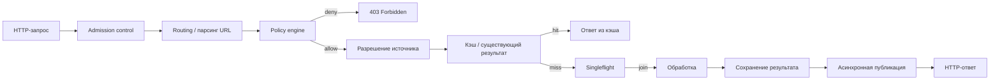

# Архитектура Imager

Imager — production-grade сервис обработки изображений на Go, построенный вокруг libvips. Сервис принимает HTTP-запросы на генерацию ассетов (изображений, полученных из исходников по правилам политики), обрабатывает их через конвейер операций и публикует результат в хранилище.

Документ описывает общую архитектуру: жизненный цикл запроса, слои приложения (ports-and-adapters), механизмы ограничения ресурсов и наблюдаемость. Смежные темы раскрыты в отдельных документах:

- [Политика доступа](POLICIES.md) — правила генерации ассетов.
- [Форматы](FORMATS.md) — поддерживаемые входные и выходные форматы.
- [AI-возможности](AI.md) — умный кроп, детекция лиц и объектов.
- [Наблюдаемость](OBSERVABILITY.md) — метрики, логи, health-эндпоинты.
- [Конфигурация](CONFIGURATION.md) — параметры и слои конфигурации.
- [Обработка](PROCESSING.md) — операции обработки и их детали.
- [Хранилища](STORAGE.md) — бэкенды исходников и результатов.

## Общий жизненный цикл запроса

Полный конвейер обработки запроса (use case `Generate` в `app/generatev2`):

1. **Admission control** — проверка лимита одновременных HTTP-запросов. При перегрузке возвращается `503` с заголовком `Retry-After`.
2. **Routing** — разбор канонического asset URL, определение источника, сегмента, DPR и выходного формата.
3. **Policy engine** — проверка правил политики (deny-by-default). Запрещённые запросы получают `403 Forbidden`.
4. **Разрешение источника** — поиск исходного файла в source-хранилище. Если исходник не найден и включён `source-fallback`, запрос перенаправляется на оригинальный файл.
5. **Кэш / существующий результат** — проверка, не был ли ассет уже сгенерирован. При совпадении возвращается готовый результат без повторной обработки.
6. **Singleflight** — дедупликация одновременных запросов на один и тот же ключ ассета. Повторные запросы ожидают завершения первого.
7. **Обработка** — построение плана обработки и выполнение операций через libvips (или извлечение кадра для видео).
8. **Сохранение результата** — запись результата в result-хранилище (атомарная публикация).
9. **Публикация** — асинхронная публикация результата в result-хранилище с bounded-очередью и синхронным fallback.
10. **Ответ** — HTTP-ответ с заголовками кэширования и метаданными.

## Слои приложения (ports-and-adapters)

Проект следует архитектуре ports-and-adapters (гексагональная архитектура). Зависимости направлены только внутрь: домен не знает об адаптерах.

| Слой | Назначение | Ключевые пакеты |
|------|-----------|-----------------|
| `domain` | Чистая доменная логика без внешних зависимостей: типы ассетов, политика, обработка, кодирование, sidecar-метаданные | `domain/asset`, `domain/policy`, `domain/processing`, `domain/encoding`, `domain/filemeta`, `domain/object` |
| `ports` | Интерфейсы (контракты) для хранилищ, bounded-буферов и т.д. | `ports/storage`, `ports/bounded` |
| `adapters` | Реализации портов: HTTP API, хранилища, процессоры, детекция, видео | `adapters/httpapi`, `adapters/storage`, `adapters/processor`, `adapters/videoframe`, `adapters/lru`, `adapters/pixel` |
| `app` | Application use cases: генерация ассетов, администрирование, learning-mode | `app/generatev2`, `app/adminsvc`, `app/learning` |
| `coordination` | Координация конкурентного доступа: singleflight | `coordination/singleflight` |
| `observability` | Метрики, логи, health, top-paths | `observability` |
| `composition` | Composition root: сборка приложения, загрузка конфигурации, фабрики | `composition` |
| `bootstrap` | Переиспользуемая composition-root логика (сборка процессора) | `bootstrap` |
| `config` | Typed config foundation для конвейера ассетов | `config` |

Публичный фасад библиотеки — `imager.go` (`NewServer`), тонкая обёртка — `cmd/imager/main.go`.

## Хранилища

### Source-хранилище

Хранит исходные файлы. Поддерживаемые бэкенды: `fs`, `s3`, `sftp`, `ftp`/`ftps`, `http` (только для чтения исходников). Подробности — в [STORAGE.md](STORAGE.md).

### Result-хранилище

Хранит сгенерированные ассеты. Поддерживаемые бэкенды: `fs`, `s3`, `sftp`, `ftp`/`ftps`. Публикация результата атомарна: для `fs` — запись во временный файл, `rename` и `fsync`; для `s3` — условный `PUT` с `If-None-Match`.

### Remote-буферы

Для remote-хранилищ используется пул spillable-буферов (`adapters/storage/remote/buffer.go`): данные держатся в памяти до лимита пула (по умолчанию 500 MiB), при превышении сбрасываются на диск. Пул имеет атомарный бюджет, читатели используют refcount.

## Policy engine

Политика — deny-by-default: запрос разрешён, только если найден подходящий `path-policy`. Сопоставление путей — по самому длинному совпадающему префиксу. Каждая path-policy определяет:

- whitelist пресетов (`presets` — список имён из `policy.presets`);
- custom-размеры (`customs` — map размер-грамматики с настройками);
- ограничения выходных форматов (whitelist `output-formats` пресета/custom);
- ограничения DPR (правила `@dpr`).

Решение принимается перечислением `DecisionReason`: `allowed`, `deny_by_default`, `path_not_allowed`, `segment_not_allowed`, `dpr_not_allowed`, `format_not_allowed`, `nil_request`.

Подробности — в [POLICIES.md](POLICIES.md).

### Механизм пресетов

Пресет — именованный набор параметров обработки (размер, качество, операции, переопределения кодеков). Пресеты объявляются в конфигурации политики и whitelist'ятся в path-policy. Приоритет параметров кодеков: переопределение в пресете → секция `encoders` YAML → автоматическое маппинг-сопоставление → дефолт реестра.

## Singleflight

`coordination/singleflight` — in-process keyed singleflight: одновременные запросы с одинаковым ключом ассета объединяются, повторные ожидают завершения первого (или получают ошибку по таймауту).

- Максимальная длина ключа: 1024 байта (`MaxKeyLen`).
- Максимальное число ключей: 16384 (`MaxKeys`).
- Таймаут ожидания: по умолчанию 60 секунд (`application.singleflight-wait-timeout`).

Singleflight защищает от «dogpile»-эффекта: при массовых запросах на один ассет обработка выполняется один раз.

## Admission control

Ограничение одновременных HTTP-запросов (`adapters/httpapi/admission.go`):

- Параметр `http.max-concurrent-requests` (по умолчанию 0 — используется fallback `application.limits.concurrency × 4`).
- При превышении лимита возвращается `503` с динамическим `Retry-After` (число занятых слотов, минимум 1 секунда).
- Запросы, присоединившиеся к singleflight-группе, обходят admission control (bypass), чтобы не блокировать ожидающих.

## Ограничения конкурентности обработки

### Слоты libvips

Обработка через libvips ограничена слотами (`libvips.limits.concurrency`, в shipped-конфиге — 8). Каждый слот — одна операция обработки. Слоты защищают от исчерпания памяти и CPU.

### Семафор детекции

AI-детекция (ONNX) использует отдельный семафор (`detection.concurrency`, по умолчанию `max(1, GOMAXPROCS/2)`, максимальное ожидание — 5 секунд). Двухуровневая схема:

1. Запрос берёт слот libvips.
2. При необходимости детекции — handoff: слот libvips освобождается, берётся слот детекции.
3. После детекции слот libvips возвращается (reacquire).

При недоступности детекции (таймаут, ошибка модели) происходит graceful degradation: умный кроп заменяется center-crop.

## Асинхронная публикация

Публикация результата в result-хранилище выполняется асинхронно:

- bounded-очередь: 512 задач;
- воркеры: 4;
- drain при завершении: 5 секунд;
- при переполнении очереди — синхронный fallback (таймаут 30 секунд);
- `ErrConflict` (ассет уже существует) трактуется как успех.

## Обработка (pipeline)

План обработки (`ProcessingPlan`) строится из запроса и исходного формата. Операции: `resize`, `crop`, `smart-crop`, `face-crop`, `object-crop`, `face-fix-crop`, `object-fix-crop`. Для видео выполняется извлечение кадра (ffmpeg/ffprobe) с последующей обработкой как изображения.

Стадии обработки:

1. Загрузка исходника (с ограничением размера, `source-bytes`).
2. Shrink-on-load (уменьшение при загрузке для JPEG/WebP/HEIF/AVIF/GIF).
3. Ориентация (EXIF) и нормализация DPI (72).
4. Операции кропа/ресайза (включая AI-кропы).
5. Водяной знак (если настроен).
6. Кодирование в выходной формат с переопределениями кодеков.
7. Стриппинг метаданных (EXIF/GPS/XMP/IPTC) или цветовая трансформация (ICC).

Подробности — в [PROCESSING.md](PROCESSING.md).

## Наблюдаемость

- Метрики: expvar, экспорт в Prometheus-формате на `/metrics`.
- Логи: slog, JSON в stderr, request ID (`X-Request-Id`, 16 байт hex).
- Health: `/healthz` (liveness) и `/readyz` (readiness).
- Middleware-порядок: Recover → observability → gzip → mux.
- Метрики защищены токеном (SHA-256 + constant-time compare) и CIDR-списком.

Подробности — в [OBSERVABILITY.md](OBSERVABILITY.md).

## Конфигурация

Конфигурация загружается из трёх слоёв (`setting/`, `generate/`, `failback/`), каждый слой — из базового файла и локального (`*-local.yaml`). Слои глубоко мёржатся (map'ы рекурсивно, скаляры заменяются, списки заменяются целиком), порядок: `setting` → `generate` → `failback`. Декодирование строгое (неизвестные поля — ошибка). Подробности — в [CONFIGURATION.md](CONFIGURATION.md).

## Завершение работы

При graceful shutdown (`SIGTERM`/`SIGINT`):

- останавливается приём новых запросов;
- завершаются in-flight запросы;
- drain публикационной очереди (5 секунд);
- сброс learning-mode (накопленные path-policies записываются в `generate-local.yaml`);
- закрытие пулов и хранилищ.

## Связанные документы

- [API.md](API.md) — HTTP API, форматы URL, коды ошибок.
- [CONFIGURATION.md](CONFIGURATION.md) — параметры конфигурации.
- [DEPLOYMENT.md](DEPLOYMENT.md) — развёртывание, Docker, CI/CD.
- [PROCESSING.md](PROCESSING.md) — операции обработки.
- [SECURITY.md](SECURITY.md) — модель безопасности.
- [STORAGE.md](STORAGE.md) — хранилища.
- [POLICIES.md](POLICIES.md) — политика доступа.
- [FORMATS.md](FORMATS.md) — форматы.
- [AI.md](AI.md) — AI-возможности.
- [OBSERVABILITY.md](OBSERVABILITY.md) — наблюдаемость.
- [DEVELOPMENT.md](DEVELOPMENT.md) — разработка и тестирование.
- [TROUNLESHOOTING.md](TROUNLESHOOTING.md) — диагностика проблем.