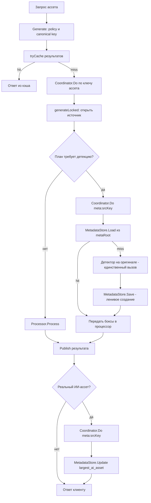

# Дизайн: локальное хранилище метаданных файла (sidecar)

Статус: проект v3 (реализован, текущая редакция). v2 — переработка размещения:
sidecar живёт ВНУТРИ локального fs-хранилища (`<локальный result-каталог>/.meta/`),
отдельный корень `data/metadata/` НЕ вводится. v3 — уточнение пользователя:
расположение метаданных настраивается ОТДЕЛЬНЫМ ключом `metadata.dir` — явным
ЛОКАЛЬНЫМ путём файловой системы, НЕЗАВИСИМЫМ от хранилищ source/result
(fs/S3/SFTP/FTP/HTTP). Метаданные ВСЕГДА хранятся локально по этому пути;
`<локальный result-каталог>/.meta` — только значение по умолчанию.
Область: кэш результатов ИИ-моделей (детекция лиц/объектов) и информация о крупнейшем
«ИИ-ассете» (заготовка под будущее увеличение разрешения). Сама апскейл-функциональность
в этом дизайне НЕ реализуется.

---

## 1. Цели и требования

| # | Требование | Решение в этом документе |
|---|------------|--------------------------|
| T1 | Ровно один файл метаданных на один родительский файл | Sidecar `<metaRoot>/<ключ родителя>.json` (`metaRoot` — см. раздел 9), зеркальная структура каталогов |
| T2 | Поле об ассете больше родителя с теми же пропорциями | `largest_ai_asset` (width/height/format/key) |
| T3 | Результаты ИИ-моделей: лица, объекты; каждая модель — ровно 1 вызов на родителя | `faces[]`, `objects[]` в координатах ОРИГИНАЛА; кэш проверяется до вызова модели |
| T4 | Ленивое создание: файл только при реальных данных | `Load` никогда не создаёт файл; `Save/Update` пишут только при фактических данных |
| T5 | Никаких лишних полей | Строгая схема: `schema_version`, `faces`, `objects`, `largest_ai_asset`, `created_at`, `updated_at` |
| T6 | Явный локальный путь метаданных, независимый от хранилищ source/result | `metadata.dir` (по умолчанию `<локальный result-каталог>/.meta`); сегмент `.meta` уже зарезервирован пакетом `fs` |
| T7 | Метаданные переживают очистку результатов (TTL/janitor/eviction) | Janitor удаляет только `.tmp-*`; квота/LRU не учитывают `.meta`; публичные ключи не могут адресовать `.meta` |

Не-цели:

- Апскейл-движок, выбор «какой ассет апскейлить» — только хранение информации.
- Метаданные о самих результатах генерации (кэш результатов — это result-store, он уже есть).
- Репликация метаданных в remote-хранилища: metadata store ВСЕГДА локальный fs,
  привязан к локальному кэшу. Где бы ни лежали source и result физически
  (fs / S3 / SFTP / FTP / HTTP), sidecar пишется только на локальный диск.
  Для remote-source это не деградация, а штатный режим: sidecar кэширует
  результаты моделей для удалённых исходников так же, как для локальных.

## 2. Терминология

- **Родитель (parent)** — исходный файл, идентифицируется ключом
  `srcKey = [path/]name.ext` (см. [`sourceKey`](../internal/application/generatev2/service.go:346)).
  Родитель может быть локальным (`data/source/about.png`) или удалённым
  (объект в S3-бакете) — для sidecar важен только ключ.
- **Sidecar** — JSON-файл метаданных родителя, ровно один на родителя.
- **Локальный result-каталог** — каталог локального fs-хранилища результатов:
  `result.path` из конфигурации (по умолчанию `./data/result`). Используется
  [`ResultStore`](../internal/adapters/storage/fs/store.go:112) при fs-режиме;
  при remote-result остаётся настроенным локальным путём (и путём работы janitor).
  Используется ТОЛЬКО для значения по умолчанию metaRoot (см. ниже).
- **metaRoot** — корень sidecar-хранилища. ОСНОВНОЙ способ задания —
  конфигурационный ключ `metadata.dir` (явный локальный путь файловой системы,
  независимый от хранилищ source/result). Если `metadata.dir` не задан —
  значение по умолчанию `<локальный result-каталог>/.meta`.
- **Боксы** — результаты детекции: прямоугольники в пикселях + confidence (+ label).
- **largest_ai_asset** — самый большой сгенерированный ассет, у которого обе стороны
  не меньше сторон родителя, а пропорции совпадают с родительскими (кандидат на будущее
  ИИ-увеличение).

## 3. Ключевые проектные решения (сводка)

| Вопрос | Решение | Альтернативы (отклонённые) |
|--------|---------|----------------------------|
| Расположение | `<metaRoot>/<srcKey>.json`, где **metaRoot = metadata.dir** (явный локальный путь, НЕЗАВИСИМЫЙ от хранилищ source/result); дефолт `<локальный result-каталог>/.meta` | Отдельный корень `data/metadata/` (v1, отклонён уточнением пользователя); рядом с исходником (read-only маунты, утечка через публичные ключи); плоский каталог по hash (нечитаемо); привязка только к result-каталогу без возможности переопределить (v2) |
| Имя каталога | `.meta` (с ведущей точкой) — сегмент УЖЕ зарезервирован в [`path.go`](../internal/adapters/storage/fs/path.go:32) и отклоняется [`cleanRelAbs`](../internal/adapters/storage/fs/path.go:123) для всех публичных ключей | `meta` без точки (потребовал бы новой резервации и правок `path.go`; не скрытый каталог) |
| Имя файла | `<srcKey>.json`, например `.meta/about.png.json`, `.meta/photos/cat.jpg.json` | `<sha256(srcKey)>.json` |
| Формат | JSON, UTF-8, `snake_case`, поля без данных — отсутствуют (`omitempty`) | BSON/SQLite — избыточно |
| Версионирование | Целое `schema_version`; чтение младших/равных версий — ок; старше известной — miss без перезаписи | Дата-версии |
| Домен | Пакет `internal/domain/filemeta`: `FileMetadata`, `PixelBox`, `AIAssetInfo` | — |
| Порт | `internal/application/ports/metadata`: `Store { Load / Save / Update }` | — |
| Адаптер | `internal/adapters/storage/fs` (тот же пакет! переиспользует неэкспортируемые `renameReplace`, `fsyncDir`, `secureOpenFile`, `walkComponentsNotSymlink`, `cleanRelAbs`) | Отдельный пакет (потерял бы доступ к утилитам) |
| Атомарность | temp (`os.CreateTemp`, префикс `.tmp-meta-`) → write → `Sync` → `Chmod 0644` → `renameReplace` → `fsyncDir` | Прямая запись (не атомарно) |
| Конкурентность | In-process: keyed singleflight по ключу `meta:<srcKey>` внутри адаптера для `Update`; чтения без блокировки (атомарный rename) | file-lock (нужен только при мультипроцессе — см. риски) |
| Детекция | Переносится на уровень приложения: generatev2 обеспечивает боксы ДО обработки и передаёт их процессору; процессор вызывает модель только если боксы не переданы | Кэширующий декоратор внутри libvips (не знает про родителя/trim-пространство) |
| Координаты боксов | Всегда в пикселях ОРИГИНАЛЬНОГО изображения; для trim-вариантов libvips транслирует боксы на вычтенный trim-offset | Хранить два набора боксов (дублирование, против минимализма) |
| Ошибки метаданных | Best-effort: сбой store не ломает генерацию (лог + деградация к прямому вызову модели) | Fail-hard |

## 4. Расположение и именование sidecar

```text
metaRoot = metadata.dir        # ЯВНЫЙ локальный путь (ОСНОВНОЙ способ задания)
значение по умолчанию (metadata.dir не задан):
<локальный result-каталог>/                  # напр. ./data/result
  .meta/                                     # подкаталог sidecar-файлов (значение по умолчанию)
    about.png.json                           # sidecar родителя about.png
    photos/
      cat.jpg.json                           # sidecar родителя photos/cat.jpg
  <файлы результатов>                        # обычный кэш ассетов, пространство ключей result
```

Правила:

1. Отображение 1:1 и инъективно: sidecar путь = `<metaRoot>/<srcKey>.json`, где `srcKey` —
   тот же нормализованный ключ, что используется [`SourceStore`](../internal/adapters/storage/fs/store.go:17),
   а `metaRoot` — корень sidecar-хранилища (см. выше): `metadata.dir`, либо по умолчанию
   `<локальный result-каталог>/.meta`. Добавление фиксированного суффикса `.json` (сам
   `metaRoot` в отображении не участвует) сохраняет взаимную однозначность: два разных
   родителя никогда не дают один sidecar-путь.
2. Выбор локального каталога (а не source-каталога):
   - source-каталог может монтироваться read-only — запись sidecar туда невозможна;
     result-каталог по контракту записываем (там работает `Publish`);
   - по умолчанию (`metadata.dir` не задан) используется локальный result-каталог
     (см. раздел 4.1) — это backward-compatible поведение;
   - если пользователь явно задал `metadata.dir`, используется строго указанный локальный
     путь, независимо от типов source/result-хранилищ (fs/S3/SFTP/FTP/HTTP);
   - janitor уже запущен на локальном result-каталоге ([`main.go`](../cmd/imager/main.go:129))
     независимо от того, является ли result-хранилище локальным или удалённым — см. раздел 7.1;
   - семантика «локальный кэш»: и результаты, и метаданные — возобновляемый локальный
     кэш; исходники — пользовательские данные, которые imager не модифицирует.
3. Привязка к типам хранилищ: metadata store ВСЕГДА локальный fs. Если source — remote
   (S3/SFTP/FTP/HTTP), sidecar всё равно создаётся локально и кэширует результаты моделей
   по ключу удалённого родителя. Если result — remote, sidecar живёт в локальном каталоге
   `metadata.dir` (по умолчанию — `<локальный result-каталог>/.meta`); janitor при этом
   по-прежнему работает по локальному `result.path`, см. раздел 7.1.
4. Безопасность пути: преобразование ключа в путь выполняется через существующую
   [`cleanRelAbs`](../internal/adapters/storage/fs/path.go:84) от корня `metaRoot`.
   Родительские ключи проходят ту же валидацию, что и для источников: запрещены `..`,
   обратный слеш, NUL, зарезервированный сегмент `.meta`, префикс `.tmp-`,
   Windows-зарезервированные имена и завершающие точка/пробел
   ([`isReservedSegment`](../internal/adapters/storage/fs/path.go:48)).
   Добавление суффикса `.json` не может породить `..` или завершающую точку
   (последний символ имени — всегда символ `n` из `json`).
5. Лимит длины: итоговый путь содержит `<srcKey>.json`, то есть длиннее ключа на
   `len(".json")` = 5 символов; [`cleanRelAbs`](../internal/adapters/storage/fs/path.go:84)
   гарантирует rel ≤ 4096 (`maxPathLen`), добавка укладывается в запас; конструктор
   адаптера дополнительно проверяет итоговый путь тем же лимитом.
6. Удаление родителя оператором должно сопровождаться удалением его sidecar
   `<metaRoot>/<srcKey>.json` (документируется для эксплуатации; автоматическая сборка
   мусора осиротевших sidecar — вне области, см. риски).

## 5. Схема JSON

```json
{
  "schema_version": 1,
  "faces": [
    { "x": 120, "y": 80, "w": 64, "h": 64, "confidence": 0.97 }
  ],
  "objects": [
    { "x": 40, "y": 30, "w": 220, "h": 180, "confidence": 0.88, "label": "person" }
  ],
  "largest_ai_asset": {
    "width": 4000,
    "height": 3000,
    "format": "webp",
    "key": "photos/cat-jpg/x4000@2.webp"
  },
  "created_at": "2026-08-24T13:00:00Z",
  "updated_at": "2026-08-24T13:05:12Z"
}
```

Спецификация полей (других полей НЕТ):

| Поле | Тип | Обязательность | Семантика |
|------|-----|----------------|-----------|
| `schema_version` | int | да | Версия схемы. Текущая — `1`. |
| `faces` | array | нет (`omitempty`) | Боксы лиц в пикселях ОРИГИНАЛА. Пустой массив `[]` — валидный результат «лиц нет», тоже кэшируется (модель больше не вызывается). |
| `objects` | array | нет (`omitempty`) | Боксы объектов в пикселях ОРИГИНАЛА. `label` опционален (у лиц отсутствует). |
| `faces[].x,y,w,h` | int | да | Левый верхний угол и размеры в px. Инварианты: `x>=0`, `y>=0`, `w>0`, `h>0`, бокс внутри кадра. |
| `*.confidence` | float | да | `[0,1]`. |
| `largest_ai_asset` | object | нет (`omitempty`) | См. раздел 8.4. |
| `largest_ai_asset.width/height` | int | да | Размеры ассета в px. |
| `largest_ai_asset.format` | string | да | Выходной формат (`jpeg|png|webp|gif|avif|heif|apng|jxl`). |
| `largest_ai_asset.key` | string | да | Канонический ключ ассета в result-store (= canonical URL без ведущего `/`) — позволяет найти файл. |
| `created_at` | string | да | RFC3339/UTC, момент первой записи файла. |
| `updated_at` | string | да | RFC3339/UTC, момент последней успешной записи. |

Правила эволюции схемы:

- Чтение: неизвестные поля игнорируются (forward-compatible в пределах мажора);
  `schema_version <= Current` — парсим; `schema_version > Current` — типизированная
  ошибка `ErrSchemaTooNew`: кэш считается промахом, ПЕРЕЗАПИСЬ ЗАПРЕЩЕНА (не топтать
  данные более новой версии сервиса).
- Повреждённый JSON / IO-ошибка чтения — `ErrCorrupt`: промах, перезапись разрешена
  (битый файл ценности не несёт).
- Будущие поля (например, отпечаток содержимого родителя) добавляются новой версией
  `schema_version`, не сейчас (требование минимализма).

Лимиты защиты (константы адаптера): максимум 1000 элементов в каждом массиве,
максимум 256 KiB на файл при чтении — защита от аномальных/подменённых файлов.

## 6. Доменный слой и порт

### 6.1 Домен: новый пакет `internal/domain/filemeta`

Проектные сигнатуры (НЕ реализация):

```go
package filemeta

// SchemaVersion — текущая версия схемы sidecar.
const SchemaVersion = 1

// PixelBox — бокс детекции в пикселях оригинального изображения.
// Зеркало detection.Box из адаптера, но без зависимости домена от адаптеров.
type PixelBox struct {
    X, Y, W, H int
    Confidence float64
    Label      string // пусто для лиц
}

// AIAssetInfo — крупнейший ИИ-ассет (больше родителя, те же пропорции).
type AIAssetInfo struct {
    Width, Height int
    Format        string
    Key           string // canonical key в result-store
}

// FileMetadata — содержимое sidecar одного родительского файла.
type FileMetadata struct {
    SchemaVersion  int
    Faces          []PixelBox   // nil = нет данных; len==0 после явной записи = «лиц нет»
    Objects        []PixelBox
    LargestAIAsset *AIAssetInfo // nil = такой ассет ещё не зафиксирован
    CreatedAt      time.Time    // UTC
    UpdatedAt      time.Time    // UTC
}

// Sentinel-ошибки домена.
var (
    ErrNotFound     = ... // sidecar отсутствует (ленивое создание: это норма)
    ErrCorrupt      = ... // битый JSON/IO при чтении
    ErrSchemaTooNew = ... // schema_version новее известной — читать/перезаписывать нельзя
)

// Validate — инварианты боксов/размеров/формата; вызывается конструкторами и Save.
func (m *FileMetadata) Validate() error
```

Различение «нет данных» и «проверено, пусто»: `Faces == nil` — модель ещё не запускалась;
`Faces != nil && len(Faces) == 0` — запускалась, лиц нет. Это критично для гарантии
«1 вызов модели» (пустой результат тоже кэшируется).

### 6.2 Порт: новый пакет `internal/application/ports/metadata`

```go
package metadata

// Store — ЛОКАЛЬНОЕ sidecar-хранилище метаданных родительских файлов.
// Реализация обязана быть безопасной для конкурентного использования в одном процессе.
type Store interface {
    // Load возвращает метаданные родителя или filemeta.ErrNotFound.
    // Никогда не создаёт файл.
    Load(ctx context.Context, parent object.ObjectKey) (*filemeta.FileMetadata, error)

    // Save атомарно записывает метаданные (создаёт файл при необходимости).
    // CreatedAt/UpdatedAt проставляет реализация, если нулевые.
    Save(ctx context.Context, parent object.ObjectKey, m *filemeta.FileMetadata) error

    // Update — атомарный read-modify-write под внутренним per-parent lock.
    // fn получает текущие метаданные (или свежий пустой объект, если файла нет)
    // и возвращает changed=false, если писать не нужно (файл не создаётся —
    // это механизм ленивого создания).
    Update(ctx context.Context, parent object.ObjectKey,
        fn func(*filemeta.FileMetadata) (bool, error)) error
}
```

Ошибки порта — доменные sentinel'ы из `filemeta` + типизированные ошибки `object`
(`object.ErrUnavailable` и т.п.) по образцу остальных портов
([`storage.go`](../internal/application/ports/storage/storage.go)).

## 7. Адаптер: `internal/adapters/storage/fs` (новый файл `metadata_store.go`)

Адаптер обязан жить в существующем пакете `fs`, потому что переиспользует его
неэкспортируемые кроссплатформенные утилиты:

| Утилита | Файл | Использование в sidecar |
|---------|------|--------------------------|
| `cleanRelAbs` | [`path.go`](../internal/adapters/storage/fs/path.go:84) | ключ → безопасный относительный путь от корня `metaRoot`; заодно отклоняет ключи с сегментом `.meta` (самозащита от адресации meta через публичные ключи) |
| `walkComponentsNotSymlink` | [`secure.go`](../internal/adapters/storage/fs/secure.go:34) | анти-symlink/junction проверка до и после `MkdirAll` |
| `secureOpenFile` | [`secure_open_windows.go`](../internal/adapters/storage/fs/secure_open_windows.go) / `_unix` / `_linux` / `_other` | чтение без symlink-гонки (O_NOFOLLOW / запрет reparse) |
| `renameReplace` | [`rename_windows.go`](../internal/adapters/storage/fs/rename_windows.go) / `_unix` / `_other` | атомарная замена (Windows: `MoveFileEx REPLACE_EXISTING|WRITE_THROUGH` + ретраи `ACCESS_DENIED`) |
| `fsyncDir` | [`fsync_windows.go`](../internal/adapters/storage/fs/fsync_windows.go) / `_unix` / `_other` | durability каталога (на Windows — no-op, как в `Publish`) |
| `writeTemp`-паттерн | [`helpers.go`](../internal/adapters/storage/fs/helpers.go:67) | запись temp с отменой по ctx |

Конструктор: `func NewMetadataStore(metaRoot string) (*MetadataStore, error)` —
абсолютный путь, как у [`NewSourceStore`](../internal/adapters/storage/fs/store.go:22);
`metaRoot` — корень sidecar-хранилища ПРЯМО (без внутреннего добавления `.meta`).
Composition root передаёт `root = metadata.dir` (если задан) либо
`filepath.Join(<эффективный локальный result-каталог>, ".meta")` по умолчанию
(см. раздел 9). Каталог создаётся лениво при первой записи (ленивое создание T4).

Алгоритмы:

- **Load**: `cleanRelAbs(metaRoot, srcKey)` → полный путь `metaRoot/<rel>.json` →
  `walkComponentsNotSymlink` → `secureOpenFile(O_RDONLY)` → чтение с лимитом 256 KiB →
  `json.Unmarshal` → проверка `schema_version` → `Validate()`. Файл отсутствует →
  `filemeta.ErrNotFound`. Блокировок нет: атомарный rename гарантирует целостность
  прочитанного.
- **Save**: `MkdirAll(dir, 0755)` + повторная symlink-проверка (как в
  [`Publish`](../internal/adapters/storage/fs/store.go:279)) →
  `os.CreateTemp(dir, ".tmp-meta-*")` (0600) → `json.Marshal` + запись → `Sync` →
  `Close` → `Chmod 0644` → `renameReplace(tmp, full)` → `fsyncDir(dir)`.
  При ошибке temp удаляется.
- **Update**: под внутренним keyed-lock (см. ниже) → `Load` (miss ⇒ свежий
  `&FileMetadata{SchemaVersion: 1}`) → `fn(m)` → `changed==false` ⇒ выход без записи →
  иначе `Save`. `CreatedAt` сохраняется из загруженного файла, `UpdatedAt = now`.
- **Ленивое создание** выполняется автоматически: единственный путь создания файла —
  `Save`, куда `Update` попадает только при `changed=true`.

Concurrency-safety:

1. **Внутри процесса** — главный механизм. Адаптер содержит собственную
   `singleflight.Group` ([`singleflight.go`](../internal/adapters/coordination/singleflight/singleflight.go))
   с ключами `"meta\x00" + parent` вокруг `Update` (read-modify-write). `Load`/`Save`
   вне групп допустимы: файл целиком замещается атомарным rename, читатель видит либо
   старую, либо новую версию.
2. **Между процессами** — out of scope (текущий деплой — один процесс, см.
   docker-compose). Гарантия при мультипроцессе ослабляется до last-writer-wins;
   усиление (lock-файл `O_EXCL`/flock) зафиксировано как будущая работа (риски, R3).

### 7.1 Взаимодействие с janitor

Janitor ([`janitor.go`](../internal/adapters/storage/fs/janitor.go)) — единственный
автоматический чистильщик в fs-хранилище. Контракт:

1. **Что удаляет**: только regular-файлы, чьё имя начинается с `.tmp-`
   ([`CleanTemps`](../internal/adapters/storage/fs/janitor.go:99)), и только старше
   `MaxAge` (по умолчанию 1 час, запуск каждые 5 минут — [`main.go`](../cmd/imager/main.go:129)).
2. **Sidecar-файлы не трогаются по построению**: имя sidecar — `<srcKey>.json`;
   чтобы оно начиналось с `.tmp-`, ключ должен был бы начинаться с `.tmp-`, а такие
   ключи отклоняются [`cleanRelAbs`](../internal/adapters/storage/fs/path.go:123)
   как зарезервированные. Файлы `.meta/**/*.json` переживают любой цикл уборки —
   они описывают родительский source, а не конкретный результат, и не имеют TTL.
3. **Осиротевшие temp-файлы sidecar убираются тем же janitor**: `Save` создаёт temp
   с префиксом `.tmp-meta-` внутри подкаталогов `.meta/`; janitor рекурсивно обходит
   весь локальный result-каталог (включая `.meta/`) и удалит брошенный temp после краха
   процесса. Отдельный второй janitor-инстанс НЕ нужен (снимает риск R8 из v1).
4. **Eviction по квоте не затрагивает sidecar**: LRU-таблица
   ([`quota.go`](../internal/adapters/storage/fs/quota.go)) пополняется только через
   `recordPublish`/`warmCache`. Sidecar публикуется НЕ через `Publish`, поэтому в таблицу
   не попадает; `warmCache` обязан пропускать поддерево `.meta` целиком
   (см. раздел 10, шаг 2b) — тогда meta-файлы не участвуют ни в квоте, ни в eviction.
5. **Удаление результатов (`Delete`, TTL-очистка оператором, `rm -rf` содержимого
   result-каталога БЕЗ `.meta`)**: sidecar продолжает жить и остаётся валидным — он
   про родителя, а не про результаты. Поле `largest_ai_asset.key` может указывать на
   удалённый результат: потребитель обязан обрабатывать `ErrNotFound` по этому ключу
   как «информация устарела» (пересчёт при следующей генерации большего ассета).

### 7.2 Изоляция от публичных ключей

Требование: ни один запрос ассета (source- или result-ключ) не может прочитать,
записать или удалить файл в `.meta/`; и наоборот, sidecar не виден как ассет.

Механизмы (все уже существуют в коде, новые проверки НЕ требуются):

1. **Резервация сегмента на уровне преобразования ключ → путь**:
   [`cleanRelAbs`](../internal/adapters/storage/fs/path.go:84) отклоняет ЛЮБОЙ ключ,
   у которого хотя бы один сегмент равен `.meta` или начинается с `.tmp-`
   ([`path.go:123`](../internal/adapters/storage/fs/path.go:123)), возвращая
   `object.ErrUnsafePath`. Действует для `SourceStore.Lookup/Open`,
   `ResultStore.Lookup/Open/ReadStream/Publish/Delete/deleteFile` — то есть закрыты
   чтение, запись, удаление и eviction одновременно.
2. **Кейс «пользователь просит asset с ключом `meta/...`»**: ключ `meta/x` (без точки)
   валиден и указывает на обычный файл `result/meta/x` — коллизии с sidecar нет,
   поскольку sidecar живут строго в `.meta/` (с точкой). Ключ `.meta/x` и любой
   вложенный (`meta/../.meta/x` — отклонён ещё по `..`) отвергаются п.1.
   Ключ вида `photos/.meta/x` тоже отвергнут: проверка посегментная, а не только
   первого сегмента.
3. **Доменная канонизация не знает про `.meta`, но не пропускает мусор**:
   [`CanonicalPath`](../internal/domain/asset/canonical.go:57) запрещает `..` и
   control-символы, [`rejectUnsafe`](../internal/domain/asset/parser.go:314) дополнительно
   запрещает `%2f`; финальная гарантия containment — именно `cleanRelAbs` в адаптере
   (defense in depth: домен + адаптер).
4. **Коллизии имён между sidecar и ассетами исключены пространственно**: sidecar
   существуют только внутри поддерева `<resultRoot>/.meta/`, а публикация ассетов
   в это поддерево запрещена п.1. Обратное тоже верно: `Load/Save` адаптера метаданных
   резолвит пути только от `metaRoot` и не может выйти наружу (тот же `within`-чек).
5. **Скрытость от листинга**: каталог с точкой не отдаётся никакими публичными
   эндпоинтами (их нет — доступ только по ключам), а операторские обходы каталогов
   обычно скрывают dot-каталоги; это удобство, не мера безопасности.
6. **Тест-контракт**: обязательные тесты (шаг 2c раздела 10) фиксируют инварианты:
   `ResultStore.Open(".meta/about.png.json")` → `ErrUnsafePath`;
   `ResultStore.Publish("x/.meta/y", ...)` → `ErrUnsafePath`;
   `warmCache` не включает файлы `.meta` в квоту; janitor не удаляет `.meta/**/*.json`.

## 8. Интеграция в generatev2

### 8.1 Новые зависимости Deps

В [`Deps`](../internal/application/generatev2/service.go:42) добавляются два
опциональных поля (nil ⇒ поведение идентично сегодняшнему, все существующие тесты валины):

```go
// Metadata — sidecar-хранилище (nil = кэш моделей отключён).
Metadata metadata.Store
// Detector — порт ИИ-детекции на уровне приложения (nil = детекция остаётся в процессоре).
Detector detector.Detector
```

Новый узкий порт `internal/application/ports/detector` (зеркало контракта
[`detection.Detector`](../internal/adapters/processor/detection/detector.go), но с
доменными `filemeta.PixelBox`); тонкий адаптер-обёртка над `detection.Detector`
создаётся в composition root. Это сохраняет правило «application не импортирует адаптеры».

### 8.2 Гарантия «1 вызов модели на родителя»

Модель вызывается ТОЛЬКО в одном месте нового кода — в `ensureDetections` приложения,
и только при промахе кэша. Псевдопоток внутри
[`generateLocked`](../internal/application/generatev2/service.go:237) сразу после
`buildPlan` и до `CheckLimits`:

```text
если план использует fc/oc/fct/oct:
    если s.deps.Metadata != nil и s.deps.Detector != nil и Detector.Available():
        boxes := Coordinator.Do(ctx, "meta:"+srcKey, func():
            m, err := Metadata.Load(srcKey)
            если ErrNotFound или ErrCorrupt  -> m = пустая
            если ErrSchemaTooNew             -> вернуть nil  // чужие данные не трогаем
            нужны Faces?  -> если m.Faces == nil:  m.Faces  = Detector.DetectFaces(rgb)
            нужны Objects?-> если m.Objects == nil: m.Objects = Detector.DetectObjects(rgb)
            Metadata.Update(srcKey, сохранить изменённое)   // ленивое создание здесь
            вернуть боксы
        )
        in.DetectionsReady = boxes != nil; in.Boxes = boxes
```

Свойства гарантии:

- конкурентные запросы разных ассетов одного родителя дедуплицируются keyed-singleflight'ом
  по `meta:<srcKey>` (второй ждёт и читает готовый sidecar);
- запросы того же ассета дедуплицируются уже существующим координатором по ключу ассета
  ([`Generate`](../internal/application/generatev2/service.go:200));
- после рестарта процесса промаха нет вовсе — решение принимает наличие sidecar;
- деградация: сбой store/детектора логируется, `DetectionsReady=false`, процессор
  работает по старой схеме (возможен повторный вызов модели — задокументированное
  исключение аварийного режима, на корректность результата не влияет).

### 8.3 Передача боксов в процессор

Расширения порта [`processor`](../internal/application/ports/processor/processor.go):

```go
type Input struct {
    Source io.ReadSeeker
    Plan   *processing.ProcessingPlan
    // Новое:
    SourceKey       object.ObjectKey  // для диагностики/будущих расширений
    DetectionsReady bool              // true = боксы валидны, модель вызывать ЗАПРЕЩЕНО
    Boxes           []filemeta.PixelBox // координаты ОРИГИНАЛА
}

type Result struct {
    Size int64
    // Новое (заполняет libvips; 0 = неизвестно):
    Width, Height       int // размеры выхода
    SourceWidth, SourceHeight int // размеры входа (из заголовка)
}
```

Изменения в libvips-бэкенде
([`applyDetectionCrop`](../internal/adapters/processor/libvips/process_libvips.go:448)):

1. Если `in.DetectionsReady` — пропуск шагов 2–3 (извлечение RGB и вызов детектора),
   использование `in.Boxes` напрямую (для fc/oc) либо после `applyTrim` — трансляция
   боксов на `(-left,-top)` от `FindTrim` с clamp в кадр (для fct/oct). Так trim-варианты
   тоже обслуживаются кэшем в координатах оригинала, и второй вызов модели не нужен.
2. Если `!DetectionsReady` — прежнее поведение (self-detection), включая понятную ошибку
   «detection is not configured».
3. Заполнение новых полей `Result` (ширина/высота до и после обработки известны из
   `img.Width()/Height()`).

ImageMagick-fallback fc/oc не поддерживает — изменения его не касаются; при нулевых
`SourceWidth/Height` обновление `largest_ai_asset` просто пропускается.

Для извлечения RGB на уровне приложения (шаг детекции в `ensureDetections`) вводится
опциональный интерфейс `processor.RGBPreparer { PrepareRGB(ctx, src) (RGBFrame, error) }`,
реализуемый libvips-бэкендом (код уже есть в `applyDetectionCrop`, выделяется в метод).
generatev2 делает type-assertion; отсутствие поддержки ⇒ деградация из 8.2.

### 8.4 Обновление largest_ai_asset

Точка: [`processAndPublish`](../internal/application/generatev2/service.go:482) сразу
после успешного `publishFromBuffer` (результат гарантированно опубликован, ключ ассета
и формат известны, размеры — из нового `Result`).

Критерий кандидата (родитель `srcW×srcH`, ассет `outW×outH`):

```text
кандидат ⇔ outW >= srcW ∧ outH >= srcH ∧ outW*outH > srcW*srcH
            ∧ |outW/outH − srcW/srcH| / (srcW/srcH) ≤ 0.01   // те же пропорции
заменить сохранённый ⇔ площадь кандидата > площадь сохранённого
```

Естественные кандидаты — DPR-ассеты (`@2`, `@3`) и запросы «больше оригинала».
Запись выполняется через `Metadata.Update` под тем же per-parent lock:

```text
Coordinator.Do(ctx, "meta:"+srcKey, func():
    Metadata.Update(srcKey, func(m):
        если кандидат лучше m.LargestAIAsset:
            m.LargestAIAsset = {outW, outH, outFormat, assetKey}; вернуть true
        вернуть false   // changed=false => файл даже не создаётся (минимализм)
    )
)
```

Best-effort: ошибки логируются, генерация клиента не затрагивается.
Если `srcW/srcH` неизвестны (нулевые) — шаг пропускается.

### 8.5 Текстовая диаграмма потока данных

```text
HTTP-запрос ассета
  └─ Generate: policy → canonical key → tryCache(result-store)
       ├─ hit  ──────────────────────────────────────────────► ответ из кэша
       └─ miss → Coordinator.Do(assetKey) → generateLocked
             ├─ открыть источник (srcKey)
             ├─ buildPlan
             ├─ [план fc/fc/fct/oct? = требуется детекция?]
             │    └─ (нет → Load/файлы НЕ трогаются)
             │    └─ да → Coordinator.Do(meta:srcKey)
             │         ├─ MetadataStore.Load(srcKey)   ← <metaRoot>/<srcKey>.json
             │         │    ├─ hit                → боксы из sidecar
             │         │    └─ miss → Detector(оригинал) [ЕДИНСТВЕННЫЙ вызов модели]
             │         │              └─ MetadataStore.Save (ленивое создание файла)
             │         └─ боксы → processor.Input (DetectionsReady=true)
             ├─ Processor.Process (модель НЕ вызывается, если DetectionsReady)
             ├─ publishFromBuffer → result-store
             └─ [выход: реальный ИИ-ассет (больше родителя и те же пропорции)?]
                  └─ да → Coordinator.Do(meta:srcKey)
                       └─ MetadataStore.Update(largest_ai_asset, changed⇒Save)
                            └─ ответ клиенту
                  └─ нет → ответ клиенту
```

Mermaid-вариант:



## 9. Конфигурация

Новая секция `metadata` в [`setting.yaml`](../config/setting.yaml) (строгая схема —
[`runtimeconfig.go`](../internal/adapters/httpapi/runtimeconfig.go) дополняется
`MetadataYAML`/`MetadataConfig`):

```yaml
metadata:
  # enabled — включить sidecar-кэш моделей и largest_ai_asset.
  # Тип: bool. Дефолт: true. false = поведение идентично текущему.
  enabled: true
  # dir — ЯВНЫЙ локальный путь sidecar-хранилища (ОСНОВНОЙ способ задания).
  # Тип: string (локальный путь fs). Независим от хранилищ source/result.
  # Если не задан — по умолчанию <локальный result-каталог>/.meta.
  # Пример: "./data/meta"
  # dir: "./data/meta"
```

Расположение метаданных настраивается ОТДЕЛЬНЫМ ключом `metadata.dir` — явным
ЛОКАЛЬНЫМ путём файловой системы, НЕЗАВИСИМЫМ от того, какие хранилища используются
для source/result (fs/S3/SFTP/FTP/HTTP). Метаданные всегда хранятся локально по этому
пути. Если `metadata.dir` не задан — значение по умолчанию `<локальный result-каталог>/.meta`
(backward-compatible).

```text
metaRoot = metadata.dir, если задан (строго, без вывода из хранилищ)
иначе    = filepath.Join(<эффективный локальный result-каталог>, ".meta")
эффективный локальный result-каталог = result.path, иначе ./data/result
```

Проводка в DI ([`app.go`](../internal/adapters/httpapi/app.go:78) `Build`):
`AppOptions.MetadataDir` (из `RuntimeConfig.MetadataDir`) → если задан, используется
строго; иначе вычисляется эффективный локальный result-каталог (та же логика выбора
`resCfg.Path` → fallback `ResultDir`, что в `ensureFSStores`) и собирается
`fs.NewMetadataStore(filepath.Join(localResultDir, ".meta"))` → `generatev2.Deps.Metadata`;
обёртка детектора → `Deps.Detector`; libvips `Options` дополняется флагом
«детекция перенесена наверх» (или детектор перестаёт передаваться в libvips, когда
включён новый режим — решение на этапе реализации, вариант с сохранением
fallback-режима предпочтителен).

Особый режим remote-result: локальный result-каталог (или `metadata.dir`) может не
существовать до первой записи sidecar — `MkdirAll` в `Save` создаст его лениво. Если
каталог не записываем (права/монтирование), все операции store возвращают ошибку;
generatev2 деградирует best-effort (раздел 8.2), генерация не ломается.

## 10. План реализации (шаги, конкретные файлы)

Шаг 1. Домен и порт
- СОЗДАТЬ `internal/domain/filemeta/filemeta.go` — `FileMetadata`, `PixelBox`,
  `AIAssetInfo`, `SchemaVersion`, sentinel-ошибки, `Validate`, JSON-DTO c `omitempty`.
- СОЗДАТЬ `internal/application/ports/metadata/metadata.go` — интерфейс `Store`.
- СОЗДАТЬ `internal/application/ports/detector/detector.go` — порт детекции на доменных боксах.
- Тесты: `filemeta_test.go` (валидация, roundtrip JSON, версии схемы).

Шаг 2. Адаптер хранилища и изоляция внутри пакета fs
- СОЗДАТЬ `internal/adapters/storage/fs/metadata_store.go` — `NewMetadataStore(root)`,
  `Load/Save/Update`, внутренний singleflight, атомарная запись на утилитах пакета;
  путь файла = `root/<cleanRelAbs(rel)>.json`; temp-префикс `.tmp-meta-`.
- ИЗМЕНИТЬ `internal/adapters/storage/fs/store.go` — `warmCache`: при встрече каталога
  с именем `reservedSegment` возвращать `filepath.SkipDir` (сейчас `return nil`
  пропускает только сам каталог, но не его содержимое — файлы `.meta/**` попали бы
  в LRU-таблицу квоты и могли стать целями eviction с гарантированной ошибкой
  удаления через containment-проверку).
- Тесты: `metadata_store_test.go` — ленивое создание, атомарность (частичный temp не виден),
  `ErrCorrupt`, `ErrSchemaTooNew` без перезаписи, symlink-защита, `-race`,
  кроссплатформенность уже обеспечена утилитами (прогон на Windows+Linux CI).
- Тесты изоляции: `store_test.go`/`path_test.go` дополнить кейсами —
  `Open/Lookup/ReadStream/Delete/Publish` с ключами `.meta/...`, `x/.meta/...`,
  `.tmp-meta-x` → `ErrUnsafePath`; janitor не удаляет `.meta/**/*.json`;
  `warmCache` не учитывает `.meta` в `Stats/CacheStats`.

Шаг 3. Процессор
- ИЗМЕНИТЬ `internal/application/ports/processor/processor.go` — поля `Input`
  (`SourceKey`, `DetectionsReady`, `Boxes`), поля `Result` (размеры), `RGBPreparer`.
- ИЗМЕНИТЬ `internal/adapters/processor/libvips/process_libvips.go` — ветка
  `DetectionsReady` (skip detection; трансляция боксов после trim), выделить
  `PrepareRGB`, заполнение размеров в `Result`.
- ИЗМЕНИТЬ `internal/adapters/processor/imagemagick/processor.go` — только пассивное
  заполнение `Result` нулями/размерами, если доступны (без детекции).
- Тесты: `trim_crop_libvips_test.go` дополнить кейсами с предзаданными боксами и трансляцией.

Шаг 4. Use case generatev2
- ИЗМЕНИТЬ `internal/application/generatev2/service.go` — `Deps.Metadata`, `Deps.Detector`;
  `ensureDetections` (после `buildPlan`), прокидывание боксов во `Input`,
  захват размеров из `Result`, `updateLargestAIAsset` после публикации.
- Тесты: `service_test.go`/`fakes_test.go` — fake store/detector: счётчик вызовов модели
  равен 1 при N конкурентных запросах разных ассетов одного родителя; пустой результат
  детекции кэшируется; сбой store не валит генерацию.

Шаг 5. Конфигурация и DI
- ИЗМЕНИТЬ `internal/adapters/httpapi/runtimeconfig.go` — секция `metadata` с ключами
  `enabled` и `dir` (strict-decode); `MetadataDir` в `RuntimeConfig`;
  `dir === ""` = значение по умолчанию `<локальный result-каталог>/.meta`.
- ИЗМЕНИТЬ `internal/adapters/httpapi/storage_factory.go` — вернуть/вычислить
  эффективный локальный result-каталог (или вынести вычисление в helper, используемый
  и для janitor-пути).
- ИЗМЕНИТЬ `internal/adapters/httpapi/app.go` — `AppOptions.MetadataDir`: если задан —
  `fs.NewMetadataStore(metadataDir)` строго; иначе
  `fs.NewMetadataStore(filepath.Join(localResultDir, ".meta"))`; передача в Deps
  (при `metadata.enabled`).
- ИЗМЕНИТЬ `cmd/imager/main.go` — `AppOptions.MetadataDir: rc.MetadataDir`, адаптер
  детектор-порт, проброс в `Build`.
- ИЗМЕНИТЬ `config/setting.yaml` + `config/setting-local.yaml` (`metadata.dir` — пример
  закомментирован).
- Тесты: `runtimeconfig_test.go` (приём `metadata.dir`; дефолт при отсутствии),
  `storage_factory_test.go`, `app_test.go` — деривация metaRoot при fs/remote-result
  и при явном `metadata.dir`.

Шаг 6. Наблюдаемость (опционально)
- ИЗМЕНИТЬ `internal/observability/metrics.go` — счётчики `metadata_hit/metadata_miss/
  metadata_write/model_call` (bounded cardinality, по образцу существующих).

Шаг 7. Документация эксплуатации
- ИЗМЕНИТЬ `docs/PRODUCTION.md` — раздел про `<result-dir>/.meta`: бэкап не обязателен
  (восстанавливается лениво), удалять sidecar при замене исходников; предупреждение
  не размещать в result-каталоге пользовательские файлы с именами, начинающимися на
  `.meta`/`.tmp-` (они будут недоступны как ассеты — by design); при remote-result
  следить, чтобы локальный result-каталог был записываем.

## 11. Риски

| # | Риск | Митигация |
|---|------|-----------|
| R1 | Замена содержимого родителя под тем же именем ⇒ устаревшие боксы/`largest_ai_asset` (отпечаток содержимого не храним — требование минимализма) | Эксплуатационное правило: при замене исходника удалить его sidecar `<resultDir>/.meta/<srcKey>.json`. Будущее: поле `parent_fingerprint` в `schema_version=2` |
| R2 | Координатная трансляция боксов после trim (fct/oct) может дать смещение при пограничных clamp-кейсах | Юнит-тесты трансляции на сетке кейсов; clamp идентичен [`fitRect`](../internal/adapters/processor/detection/box.go:257) |
| R3 | Мультипроцессный запуск на одном томе ⇒ last-writer-wins, потеря параллельного обновления | Деплой-контракт: один процесс на том. Будущее: lock-файл/O_EXCL-страж в адаптере |
| R4 | Недоступность/сбой sidecar-store ⇒ повторные вызовы моделей (деградация производительности, не корректности) | Best-effort семантика, WARN-логи, метрики |
| R5 | Разрастание sidecar (много объектов) | Лимиты: ≤1000 записей на массив, ≤256 KiB файл; `MaxObjects` конфигурации детектора |
| R6 | Windows: `renameReplace` поверх файла, открытого читателем ⇒ `ACCESS_DENIED` | Уже решено ретраями в [`rename_windows.go`](../internal/adapters/storage/fs/rename_windows.go:24); читатели держат файл коротко |
| R7 | `ErrSchemaTooNew` после даунгрейда версии сервиса ⇒ кэш временно не используется (модели зовутся снова) | Осознанный компромисс безопасности данных; задокументировать в PRODUCTION.md |
| R8 | Осиротевшие `.tmp-meta-*` при краше процесса | Решено БЕЗ второго janitor: temp-файлы лежат внутри локального result-каталога и подпадают под существующий janitor (префикс `.tmp-`, раздел 7.1) |
| R9 | warmCache включает `.meta/**` в LRU-таблицу ⇒ meta-файлы считаются в квоте, eviction пытается их удалить и падает на containment | Шаг 2b плана: `filepath.SkipDir` для `reservedSegment` в `warmCache` + регресс-тест на `Stats/CacheStats` |
| R10 | Remote-result: локальный result-каталог не записываем ⇒ sidecar недоступен | Best-effort деградация (R4); требование к эксплуатации: каталог записываем (PRODUCTION.md) |
| R11 | Оператор вручную создаёт в result-каталоге файлы/каталоги с именами `.meta*`/`.tmp-*` ⇒ недоступны как ассеты | Документировано в PRODUCTION.md; поведение согласовано с уже существующей резервацией `.tmp-*` |

## 12. Рассмотренные альтернативы

1. **Отдельный корень `data/metadata/`** (v1 этого документа) — отклонён уточнением
   пользователя: метаданные должны жить внутри существующего локального fs-хранилища,
   без нового корня верхнего уровня.
2. **Sidecar рядом с исходником** (`data/source/about.png.json`) — отклонено: read-only
   маунты источника делают запись невозможной; sidecar стал бы доступен как «источник»
   `about.png.json`; смешивание пользовательских и служебных файлов.
3. **Каталог `meta` без ведущей точки** (`<resultDir>/meta/`) — отклонено: сегмент `.meta`
   уже зарезервирован константой `reservedSegment` в
   [`path.go`](../internal/adapters/storage/fs/path.go:32), проверяется в
   [`cleanRelAbs`](../internal/adapters/storage/fs/path.go:123) и учитывается в
   [`warmCache`](../internal/adapters/storage/fs/store.go:147); выбор `meta` потребовал бы
   второй резервации в горячем security-коде `cleanRelAbs` без преимуществ перед
   точечным вариантом.
4. **Sidecar в source-корне** (`<sourceDir>/.meta/`) — отклонено: нарушает read-only
   контракт источника; janitor там не запущен (temp-файлы не убирались бы).
5. **Плоский каталог по hash** (`<resultDir>/.meta/<sha256>.json`) — отклонено: нет
   человекочитаемой связи с родителем, затруднена ручная диагностика и точечная очистка.
6. **Кэширующий декоратор Detector внутри libvips** — отклонено как основное: декоратор
   не знает родителя и координатное пространство (trim), потребовал бы расширения
   `Input` всё равно; приложение — правильное место политики «1 вызов на родителя».
7. **Единая SQLite-база метаданных** — отклонено: нарушает требование «ровно один файл
   на родитель», добавляет движок и миграции.

## 13. Чеклист файлов этапа реализации

Новые файлы:

- [ ] `internal/domain/filemeta/filemeta.go` — домен: `FileMetadata`, `PixelBox`, `AIAssetInfo`, `SchemaVersion`, sentinel-ошибки, `Validate`, JSON-DTO.
- [ ] `internal/domain/filemeta/filemeta_test.go` — валидация, roundtrip, версии схемы, лимиты.
- [ ] `internal/application/ports/metadata/metadata.go` — порт `Store { Load / Save / Update }`.
- [ ] `internal/application/ports/detector/detector.go` — порт детекции на `filemeta.PixelBox`.
- [ ] `internal/adapters/storage/fs/metadata_store.go` — адаптер: `NewMetadataStore`, `Load/Save/Update`, singleflight `meta:<srcKey>`, атомарная запись, лимиты 1000/256 KiB.
- [ ] `internal/adapters/storage/fs/metadata_store_test.go` — ленивое создание, атомарность, `ErrCorrupt`/`ErrSchemaTooNew`, symlink, `-race`, изоляция `.meta`.

Изменяемые файлы:

- [ ] `internal/adapters/storage/fs/store.go` — `warmCache`: `filepath.SkipDir` для `.meta` (шаг 2b).
- [ ] `internal/adapters/storage/fs/path_test.go` — кейсы резервации `.meta`/`.tmp-meta-*` (регрессия изоляции).
- [ ] `internal/adapters/storage/fs/store_test.go` — кейсы `Open/Publish/Delete` на `.meta/...` → `ErrUnsafePath`; janitor × `.meta`.
- [ ] `internal/application/ports/processor/processor.go` — `Input.SourceKey/DetectionsReady/Boxes`, `Result` размеры, `RGBPreparer`.
- [ ] `internal/adapters/processor/libvips/process_libvips.go` — ветка `DetectionsReady`, трансляция боксов после trim, `PrepareRGB`, размеры в `Result`.
- [ ] `internal/adapters/processor/libvips/trim_crop_libvips_test.go` — кейсы предзаданных боксов и trim-трансляции.
- [ ] `internal/adapters/processor/imagemagick/processor.go` — пассивное заполнение размеров `Result`.
- [ ] `internal/application/generatev2/service.go` — `Deps.Metadata/Deps.Detector`, `ensureDetections`, прокидывание боксов, `updateLargestAIAsset`.
- [ ] `internal/application/generatev2/service_test.go`, `internal/application/generatev2/fakes_test.go` — fake store/detector, «1 вызов модели», кэширование пустого результата.
- [ ] `internal/adapters/httpapi/runtimeconfig.go` — секция `metadata`: `enabled` и `dir` (`MetadataDir` в `RuntimeConfig`).
- [ ] `internal/adapters/httpapi/runtimeconfig_test.go` — strict-decode `metadata.*`; приём явного `metadata.dir`; дефолт при отсутствии.
- [ ] `internal/adapters/httpapi/storage_factory.go` — вычисление эффективного локального result-каталога (helper для metaRoot).
- [ ] `internal/adapters/httpapi/storage_factory_test.go` — деривация metaRoot при fs/remote-result.
- [ ] `internal/adapters/httpapi/app.go` — сборка `fs.NewMetadataStore` и проводка в `Deps.Metadata`.
- [ ] `internal/adapters/httpapi/app_test.go` — сборка pipeline с включённым/выключенным metadata.
- [ ] `cmd/imager/main.go` — адаптер детектор-порта, проброс в `Build`.
- [ ] `internal/observability/metrics.go` — (опционально) `metadata_hit/miss/write/model_call`.
- [ ] `config/setting.yaml`, `config/setting-local.yaml` — документация `metadata.enabled` и `metadata.dir` (закомментированный пример).
- [ ] `docs/PRODUCTION.md` — эксплуатация `<result-dir>/.meta` (раздел шага 7).
