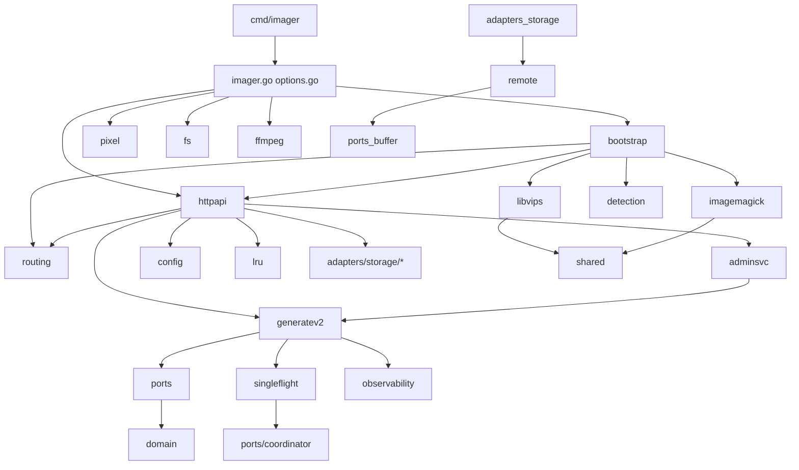

# Архитектурный аудит Go-проекта imager (d:/imager)

Подготовка к выкладыванию в опенсорс. Отчёт — источник истины для последующих подзадач.
Модуль: `github.com/pkg-ru/imager` (go 1.25.0, go.work присутствует).

---

## 1. Карта модулей

### Слои (сверху вниз)

| Слой | Пакеты | Назначение |
|---|---|---|
| **Composition root** | `imager.go`, `options.go`, `cmd/imager/main.go`, `bootstrap/` | Фасад библиотеки: `NewServer` (YAML-сценарий), `New` (программная сборка), тонкий main. `bootstrap` — переиспользуемая сборка процессоров (libvips primary + ImageMagick fallback), `SlogLevel`, `Fatal`. |
| **adapters/httpapi** | HTTP-адаптер: handler asset URL, admin handler, mux, runtime (listener + graceful shutdown), configloader (3 слоя YAML: setting/generate/failback), runtimeconfig (typed YAML→RuntimeConfig), storage_factory (FS/S3/SFTP/FTP/HTTP), admission control, gzip, fallback-файл, health. |
| **app** | `app/generatev2` — use case GenerateAsset (cache lookup → policy → singleflight → processor → bounded output → atomic publish); `app/adminsvc` — admin use case (generate/delete/enumerate). |
| **coordination** | `coordination/singleflight` — in-process keyed singleflight адаптер порта `coordinator.Keyed`. |
| **adapters/storage** | `fs` (локальное хранилище: secure open, quota, janitor, metadata store), `remote` (shared: generic Pool-limiter, spillable Buffer+BufferPool, MapError, IsConnErr, opthelpers), `s3`, `sftp`, `ftp`, `http`. |
| **adapters/processor** | `libvips` (primary, build tag `libvips`; watermark cache, detection gate, shrink-on-load, encoders), `imagemagick` (fallback CLI), `routing` (primary/fallback маршрутизатор по capabilities), `detection` (ONNX face/object detector, build tag `onnx` + stub), `shared` (Semaphore, BoundedWriter). |
| **adapters/videoframe/ffmpeg** | Извлечение кадра из видео (ffmpeg/ffprobe), contrast/math утилиты. |
| **adapters/lru** | Generic потокобезопасный bounded LRU-кэш. |
| **adapters/pixel** | Генератор not-found пикселей (встроенные APNG/AVIF/GIF/HEIF/JPEG). |
| **ports** | Интерфейсы: `storage` (SourceStore/ResultStore), `processor`, `coordinator`, `detector`, `metadata`, `buffer`, `videoframe`. Зависят только от domain. |
| **domain** | `asset` (парсинг URL, канонизация, пресеты), `policy` (deny-by-default политика, компиляция YAML), `processing` (план обработки, watermark, orientation), `object` (типизированные ошибки хранилища), `filemeta` (sidecar-метаданные). |
| **config** | DTO конфигурации (`dynamic` типы), Validate/Normalize/Compile в domain-объекты. |
| **observability** | Logger (slog), Metrics (expvar StdMetrics/Nop), middleware (request id, статус), TopPaths, vips metrics provider, metrics handler. |

### Граф зависимостей (упрощённо)

---

## 2. Зависимости между пакетами и нарушения слоёв

Проверено полным поиском импортов `github.com/pkg-ru/imager/...` (106 совпадений).

### Соблюдённые правила

- `domain/**` не импортирует ничего из проекта, кроме соседних domain-пакетов и внешней `github.com/pkg-ru/dynamic` — чисто.
- `ports/**` зависят только от `domain` — чисто.
- `config` зависит только от `domain` + `dynamic` — чисто.
- `coordination/singleflight` зависит от `ports/coordinator` + `domain/object` — допустимо (адаптер порта).
- `app/generatev2` зависит от ports/domain/observability/singleflight — корректно.

### Найденные нарушения / пограничные случаи

1. **`adapters/httpapi/app.go:7-19` — adapter импортирует app-слой** (`app/adminsvc`, `app/generatev2`) и `config`, `coordination/singleflight`. Это composition-root логика, живущая внутри адаптера. Аналогично `handler.go` импортирует `app/generatev2`, `admin_handler.go` — `app/adminsvc`.
   - Следствие: пакет `httpapi` стал «бог» (config loader + runtime + DI + handlers + factory хранилищ ≈ 6+ ответственностей, файл runtimeconfig.go >1100 строк).
   - Рекомендация: выделить композицию в отдельный пакет (например `runtime/` или поднять в `bootstrap`), оставив в `httpapi` только транспорт.

2. **`adapters/httpapi/config.go:13-15`** — Config HTTP-адаптера импортирует `ports/storage` и `observability`: интерфейсы в конфиге адаптера — терпимо, но усиливает связность.

3. **`adapters/storage/fs/metadata_store.go:12-17`** — FS-хранилище импортирует `coordination/singleflight` напрямую, минуя порт `ports/coordinator`. Дублирует поведение app-слоя (singleflight уже применяется в generatev2) — см. п.5.4.

4. **`imager.go` (фасад) знает все слои** — это норма для composition root, задокументировано в doc-comment.

5. **Циклов нет** — проверка по всем импортам циклов не обнаружила.

---

## 3. Кандидаты на дублирование логики

### 3.1 Retry-каркас FTP vs SFTP — почти идентичен (высокий приоритет)

- [`adapters/storage/ftp/retry.go:48`](../adapters/storage/ftp/retry.go:48) `withRetry[T]`
- [`adapters/storage/sftp/retry.go:52`](../adapters/storage/sftp/retry.go:52) `withRetryPolicy[T]` + `withRetry[T]`

Тело функций совпадает построчно (acquire → needDiscard cleanup → op → классификация raw-ошибки → discard+retry до MaxAttempts → ctx check). Отличие только в типе соединения (`*pooledConn` vs `*pooledClient`) и классификаторе (`isConnErr` vs `policy`). Оба уже используют общие `remote.MapError`, `remote.IsConnErr`, `remote.Attempts`, `remote.WithOpTimeout`.

**Рекомендация:** обобщить до одного generic-каркаса в `remote`: `remote.WithRetry[T, C any](ctx, acquire func() (C, error), discard func(C), classify func(error) bool, attempts int, op func(C) (T, error, error))`.

Также дублируются:
- `Options.attempts()` / `Options.withTimeout()` — идентичны в [`ftp/ftp.go:102-110`](../adapters/storage/ftp/ftp.go:102) и [`sftp/sftp.go:211-219`](../adapters/storage/sftp/sftp.go:211);
- `store` struct + `newStore` + `getConn/getClient` — идентичная структура;
- `connPool` обёртки над `remote.Pool` ([`ftp/pool.go:35`](../adapters/storage/ftp/pool.go:35), [`sftp/pool.go:49`](../adapters/storage/sftp/pool.go:49)) — отличаются только dial/close и типом;
- `pooledConn.discard` / `pooledClient.discard` — одинаковый паттерн entry.Discard / прямой close.

### 3.2 Три реализации «bounded limit» на вывод

| Реализация | Файл | Sentinel |
|---|---|---|
| BoundedWriter (writer + cancel) | [`adapters/processor/shared/boundedwriter.go:23`](../adapters/processor/shared/boundedwriter.go:23) | `ErrOutputLimitExceeded` |
| boundedReader (reader, проверка ДО чтения, reset для retry) | [`app/generatev2/service.go:789`](../app/generatev2/service.go:789) | `errOutputLimit` (service.go:31) |
| io.LimitReader ad-hoc | [`libvips/processor.go:353,415`](../adapters/processor/libvips/processor.go:353), [`fs/metadata_store.go:179`](../adapters/storage/fs/metadata_store.go:179), [`httpapi/admin_handler.go:188`](../adapters/httpapi/admin_handler.go:188) | — |

Reader и Writer решают разные задачи (лимит входа процессора vs лимит выхода use case), но sentinel-ошибки дублируют смысл. **Рекомендация:** оставить два типа, но вынести оба в общий пакет (например `internal/bounded`), дать единый экспортируемый sentinel `ErrLimitExceeded` и переиспользовать его в outcome-маппинге.

### 3.3 Semaphore-тесты продублированы полностью

- [`adapters/processor/shared/semaphore_test.go`](../adapters/processor/shared/semaphore_test.go) — канонические тесты `Semaphore` (7 тестов + helper `waitForWaiting`);
- [`adapters/processor/libvips/processor_test.go:227-292`](../adapters/processor/libvips/processor_test.go:227) — те же тесты повторно (`TestSemaphoreAllowsConcurrent`, `TestSemaphoreTooManyWaiting`, `TestSemaphoreCancel` + копия helper `waitForWaiting`).

**Рекомендация:** удалить semaphore/bounded-writer тесты из `processor_test.go` (они тестируют `shared`, а не libvips; libvips-специфика покрыта `detectionsemaphore_test.go`).

### 3.4 Двойной singleflight

- App-уровень: `generatev2` использует `coordinator.Keyed` (реализация `coordination/singleflight`) для dedup генерации.
- Адаптер-уровень: [`adapters/storage/fs/metadata_store.go`](../adapters/storage/fs/metadata_store.go) импортирует `coordination/singleflight` для собственной блокировки sidecar-файлов.

Два независимых механизма блокировки на одном ключе. **Рекомендация:** оценить, нужен ли второй уровень; если да — принимать `coordinator.Keyed` через Deps, а не конструировать внутри адаптера.

### 3.5 LRU-кэши: три самописных

1. [`adapters/lru/lru.go`](../adapters/lru/lru.go) — generic LRU (используют s3 metadata cache и httpapi etagCache).
2. [`libvips/watermarkcache.go:123`](../adapters/processor/libvips/watermarkcache.go:123) `watermarkCache` — собственный LRU + TTL + byte-budget + singleflight на `container/list`.
3. [`observability/toppaths.go`](../observability/toppaths.go) `TopPaths` — ещё один bounded map с вытеснением.

WatermarkCache оправдан (TTL + байтовый бюджет + инвалидация по mtime), но внутренняя LRU-логика могла бы опираться на `adapters/lru` с расширением (TTL/bytes). **Рекомендация:** не объединять насильно; пометить как «приемлемый дубль», но вынести TTL-обёртку в `adapters/lru` при следующем рефакторинге.

### 3.6 Пулы соединений

- [`remote/pool.go`](../adapters/storage/remote/pool.go) — generic limiter-pool (без реального переиспользования);
- [`ftp/pool.go`], [`sftp/pool.go`] — тонкие обёртки (см. 3.1);
- [`remote/buffer.go`] `BufferPool` — пул памяти (другая семантика, не дубль).

### 3.7 Маппинг ошибок S3 поверх общего MapError

[`adapters/storage/s3/s3.go:183`](../adapters/storage/s3/s3.go:183) `MapError` оборачивает `remote.MapError(op, remote.NotFound(...))` — двойная упаковка NotFound выглядит запутанно (строки 188-196: три ветки сводятся к одному и тому же вызову). Упростить.

### 3.8 Конфигурация: тройное дублирование полей storage

`ReadTimeout/MaxAttempts/MaxIdleConns` объявлены отдельно в:
- `RemoteStorageConfig` ([`httpapi/runtimeconfig.go:298-302`](../adapters/httpapi/runtimeconfig.go:298)),
- `Options` каждого адаптера (ftp:74-77, sftp:70-73, http:52-55, s3),
- дефолты продублированы: `defaultMaxAttempts=3` в [`http/http.go:71`](../adapters/storage/http/http.go:71) и `s3DefaultMaxAttempts=3` в [`storage_factory.go:246`](../adapters/httpapi/storage_factory.go:246).

**Рекомендация:** единая структура `remote.ConnOptions` + один Normalized().

### 3.9 Прочие мелкие дубли

- `mustPreset`/`mustPresetSet` продублированы в [`app/generatev2/service_test.go:72`](../app/generatev2/service_test.go:72) и [`app/adminsvc/service_test.go:369-388`](../app/adminsvc/service_test.go:369); `safePolicy`/`unsafePolicy`/`emptyReader` там же.
- `waitForWaiting` — копия в двух файлах (см. 3.3).
- `TestParseDPRRange` — имя занято дважды в разных пакетах ([`domain/asset/parser_test.go:486`](../domain/asset/parser_test.go:486) и [`domain/policy/compile_test.go:299`](../domain/policy/compile_test.go:299)); тесты разные по сути, но имя вводит в заблуждение — переименовать asset-версию в `TestParseDPRSuffix`.
- `fakeProcessor` существует в трёх вариантах: [`app/generatev2/fakes_test.go:252`](../app/generatev2/fakes_test.go:252) (полнофункциональный), [`app/generatev2/fakes_meta_test.go:154`](../app/generatev2/fakes_meta_test.go:154) (`fakeMetaProcessor` + Sized), [`adapters/httpapi/fakes_test.go:310`](../adapters/httpapi/fakes_test.go:310) (простой).
- `memSourceStore`/`memResultStore`/`memArtifact`/`memStream` дублируются между [`app/generatev2/fakes_test.go`](../app/generatev2/fakes_test.go) и [`adapters/httpapi/fakes_test.go`](../adapters/httpapi/fakes_test.go) + третий вариант `adminMemArtifact/adminMemSourceStore/adminMemResultStore` в [`adapters/httpapi/admin_handler_test.go:74-215`](../adapters/httpapi/admin_handler_test.go:74).
- `recordingMetrics` (fake Metrics) в [`adapters/httpapi/source_fallback_test.go:16`](../adapters/httpapi/source_fallback_test.go:16) и [`observability/middleware_test.go:80`](../observability/middleware_test.go:80).

---

## 4. Кандидаты на мёртвый код

### 4.1 Легитимные build-tag заглушки (НЕ удалять, но проверить CI-покрытие)

| Файл | Tag | Статус |
|---|---|---|
| [`adapters/processor/detection/onnx_stub.go`](../adapters/processor/detection/onnx_stub.go) | `!onnx` | используется (NewDetector без тега) |
| [`adapters/processor/libvips/process_stub.go`](../adapters/processor/libvips/process_stub.go) | `!libvips` | используется |
| [`adapters/storage/fs/fsync_other.go`, `quota_other.go`, `rename_other.go`, `secure_open_other.go`, `secure_open_linux.go`, `*_unix.go`, `*_windows.go`](../adapters/storage/fs) | платформенные | используются |

Риск для опенсорса: нет CI-задачи, собирающей `-tags "libvips onnx"` — реальные (не stub) ветки могут не компилироваться. Проверить Makefile/.github.

### 4.2 Подозрительные на неиспользование

1. **[`adapters/httpapi/fallback.go:9`](../adapters/httpapi/fallback.go:9) `openFallback`** — функция-обёртка из одной строки `os.Open`, единственный вызов в `handler.go:434`. Комментарий обещает «гарантию статуса 404», которую os.Open не даёт. Кандидат на инлайн или на реализацию заявленной семантики.

2. **`MaxIdleConns` в ftp/sftp Options** — документировано как «игнорируется» ([`ftp/pool.go:34`](../adapters/storage/ftp/pool.go:34)), но поле пробрасывается из конфига (`storage_factory.go:137,156`) — мёртвая настройка, вводящая пользователей в заблуждение. Удалить из YAML-схемы или реализовать.

3. **`neverRetry`** ([`sftp/retry.go:98`](../adapters/storage/sftp/retry.go:98)) — проверить использование; если Publish использует `withRetryPolicy(..., neverRetry, ...)` — заменить на прямой вызов без retry-каркаса.

4. **`remote.Buffer` reader-интерфейс**: Buffer реализует io.Reader/io.Seeker сам И отдаёт NewReader — двойной API; проверить, используется ли прямой Read/Seek буфера.

5. **`observability.TopPaths.Snapshot`** ([`toppaths.go:105`](../observability/toppaths.go:105)) — полный алиас `Top(n)`; один из двух методов лишний.

6. **`options.go` `App.AdminSvc/AdminHandler`** — проверить, читает ли их кто-то кроме фасада (экспонирование внутренних типов наружу).

7. **`domain/filemeta.ShouldTrackAsAIAsset`**, `filemeta.Clone` — покрыты тестами; использование вне fs/metadata_store не найдено поиском — проверить перед удалением (вероятно, используется в service_meta.go).

8. **`example/not-found.html`** — используется ли fallback-конфигом по умолчанию? Если нет — переместить в docs.

### 4.3 Fakes (не мёртвые, но требующие консолидации)

Полный список см. §6 — все активны в тестах своих пакетов, но три копии mem-store/fake-processor — кандидат на общий `testutil`.

---

## 5. Оценка механизмов контроля/защиты

| Механизм | Где | Оценка |
|---|---|---|
| **LRU** | `adapters/lru` (generic), s3 cache, etagCache | Хорошо. Единая точка. |
| **WatermarkCache** | `libvips/watermarkcache.go` | Хорошо изолирован (без build-tag), свой LRU+TTL+budget+singleflight. Глобальный `wmCacheOnce` (process_libvips.go:1149) — скрытое глобальное состояние: первая конфигурация выигрывает, повторный New с другими настройками молча игнорирует их. Для библиотечного фасада — баг-кандидат при нескольких Processor в одном процессе. |
| **Semaphore** | `shared.Semaphore` (bounded slots + bounded waiting + maxWait) | Единственная реализация, используется libvips (2 шт: vips+detection gate) и imagemagick. `httpapi/admissionControl` — отдельный простой channel-semaphore (503+Retry-After): семантика другая (fail-fast без очереди), объединять не стоит, но задокументировать различие. |
| **BoundedWriter** | `shared` | Ок. Дубль sentinel с generatev2 errOutputLimit (см. 3.2). |
| **Retry** | ftp/sftp withRetry (dup), s3 AWS SDK standard retryer, http MaxAttempts, generatev2 publish backoff (50ms→2s, 3 попытки) | Четыре несвязанные retry-политики. FTP/SFTP объединить (3.1). Publish-backoff ок. Задокументировать, что s3/http используют свои. |
| **Pool** | `remote.Pool` (limiter, без reuse) + ftp/sftp wrappers + BufferPool | Консистентно. Название Pool вводит в заблуждение (нет переиспользования) — переименовать в Limiter или добавить reuse. |
| **Gzip** | `httpapi/gzip.go` — только JSON envelope | Корректно (Vary, q=0, Content-Length del). Нет пула gzip.Writer — при высокой доле JSON-ошибок аллокации; низкий приоритет. |
| **Fallback** | routing (libvips→imagemagick), httpapi serveFallbackFile, pixel not-found | Три разных «fallback»: движков, файла, пикселя. Семантики не путаются. `openFallback` упростить (4.2.1). |
| **Admission** | `httpapi/admission.go` | Простой fail-fast. Не интегрирован с метриками (нет счётчика отклонённых) — добавить metric. |
| **Singleflight** | coordination/singleflight + wmCache internal + fs metadata_store | Три места (см. 3.4). |

---

## 6. Реорганизация тестов

### 6.1 Предложить общий пакет `internal/testutil` (или `testutil/`)

Перенести туда (изменив суффиксы файлов на обычные .go с build-tag `//go:build` отсутствием — пакет только для тестов через отдельный модуль или `internal`):

| Актив | Из | Используют |
|---|---|---|
| `memSourceStore`, `memResultStore`, `memArtifact`, `memStream` | generatev2/fakes_test.go, httpapi/fakes_test.go, admin_handler_test.go (3 копии) | generatev2, httpapi, adminsvc |
| `fakeProcessor` (+варианты meta/sized) | generatev2/fakes_test.go, fakes_meta_test.go, httpapi/fakes_test.go | 3 пакета |
| `fakeDetector` | generatev2/fakes_meta_test.go, httpapi/fakes_test.go | 2 пакета |
| `fakeGenerator` | httpapi/fakes_test.go, admin_handler_test.go (adminFakeGenerator) | 2 пакета |
| `mustPreset`, `mustPresetSet`, `safePolicy`, `unsafePolicy`, `emptyReader` | generatev2/service_test.go, adminsvc/service_test.go | 2 пакета |
| `requireLocalhostTCP` | httpapi/fakes_test.go | runtime/integration тесты |
| `waitForWaiting` | shared/semaphore_test.go, libvips/processor_test.go | после удаления дублей останется 1 |
| `recordingMetrics` | httpapi/source_fallback_test.go, observability/middleware_test.go | 2 пакета |

Ограничение: fakes в `_test.go` не импортируются между пакетами. Варианты: (a) `internal/testutil` обычный пакет, импортируется только из _test.go — приемлемо; (b) external test package `package httpapi_test` — частично. Рекомендация (a).

### 6.2 Дублирующиеся тестовые файлы — сократить

- `libvips/processor_test.go:225-330` — удалить секции semaphore/bounded writer (тесты shared-пакета, уже покрыты в самом shared).
- `admin_handler_test.go` — adminMem*-набор заменить на testutil-версии (~140 строк экономии).
- `fakes_meta_test.go` — `fakeMetaProcessorSized` встроить в общий fakeProcessor через опцию size.

### 6.3 Малозначимые тесты (оставить, но знать)

- `fastpath_test.go`, `concurrency_test.go` (generatev2) — полезны, не трогать.
- `fuzz_test.go` (asset, fs) — держать в CI short-mode.
- Интеграционные `integration_test.go` (httpapi, ffmpeg) — требуют внешних бинарников; убедиться, что скипаются без ffmpeg/libvips (ffmpeg integration уже скипается по наличию бинарника — проверить).

### 6.4 Именование

- Переименовать `TestParseDPRRange` в parser_test.go → `TestParseDPRSuffix` (коллизия имён с compile_test.go).

---

## 7. Приоритетные рекомендации

| # | Приоритет | Действие |
|---|---|---|
| 1 | P0 | CI: матрица сборок `-tags ""`, `-tags libvips`, `-tags "libvips onnx"`, windows/linux — иначе stub-ветки скроют поломки реальных. |
| 2 | P0 | Вынести composition root из `adapters/httpapi` (app.go/runtimeconfig.go/storage_factory.go) в отдельный пакет; httpapi оставить транспортом. |
| 3 | P1 | Объединить retry/pool/options ftp+sftp в generic-каркас `remote` (§3.1). |
| 4 | P1 | Создать `internal/testutil`, консолидировать fakes/helpers (§6.1), удалить дубли semaphore-тестов (§3.3). |
| 5 | P1 | Единый `remote.ConnOptions` для ReadTimeout/MaxAttempts/MaxIdleConns; убрать мёртвый MaxIdleConns из ftp/sftp (§4.2.2). |
| 6 | P2 | Унифицировать sentinel ошибок лимита (shared.ErrOutputLimitExceeded ↔ generatev2.errOutputLimit) (§3.2). |
| 7 | P2 | Исправить/удалить `openFallback` (§4.2.1); упростить s3.MapError (§3.7). |
| 8 | P2 | Пересмотреть глобальный `wmCacheOnce` (§5 WatermarkCache) — принимать кэш через Options. |
| 9 | P3 | Переименования (TestParseDPRSuffix, remote.Pool→Limiter), метрика отклонений admission, пул gzip.Writer. |
