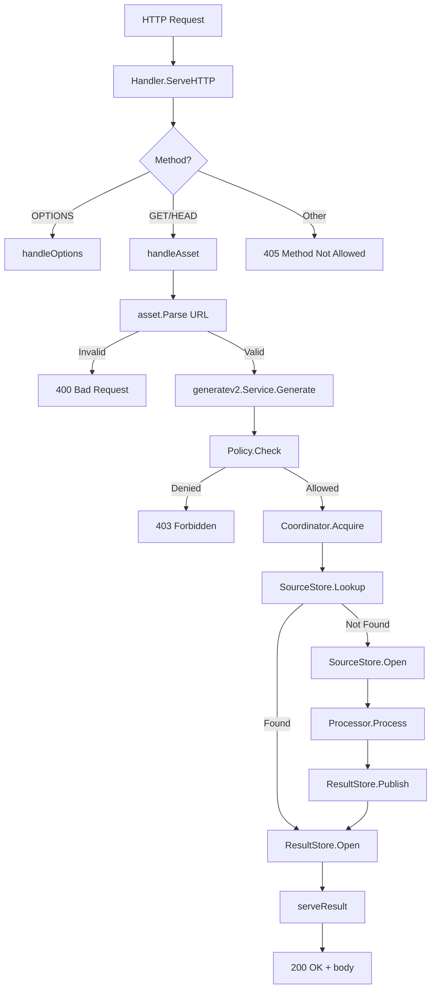

# Отчёт об аудите проекта Imager

**Дата:** 2026-08-19
**Scope:** Полный read-only аудит production и legacy конвейеров
**Версия Go (модуль):** 1.25.0
**Версия Go (CI/Docker):** 1.23.7

---

## 1. Executive Summary

Проект Imager — это image processing proxy, принимающий канонические URL ассетов, генерирующий/кэширующий изображения через ImageMagick и отдающий результат с постоянными cache headers. Проект находится в активной фазе перехода от legacy-монолита к Clean Architecture.

**Ключевые выводы:**

- **Production-контур** ([`cmd/imager`](cmd/imager/main.go) → [`internal/adapters/httpapi`](internal/adapters/httpapi/) → [`internal/application/generatev2`](internal/application/generatev2/service.go)) в целом качественно спроектирован и соответствует принципам Clean/Hexagonal Architecture.
- **Legacy-контур** (корневой [`main.go`](main.go) → [`internal/controller`](internal/controller/controller.go) → [`internal/app`](internal/app/app.go) → [`internal/application/generate`](internal/application/generate/generate.go) → [`internal/handler/http`](internal/handler/http/handler.go) → [`internal/infrastructure/*`](internal/infrastructure/)) дублирует ~40% кодовой базы и должен быть удалён после подтверждения обратной совместимости.
- Обнаружено **2 критические уязвимости безопасности** (отключённая проверка TLS-сертификатов FTPS и host-key SFTP).
- Обнаружено **расхождение версий Go** между модулем (1.25.0) и CI/Docker (1.23.7).
- Отсутствует **глобальное ограничение конкурентности** ImageMagick-процессов.
- CI **не выполняет реальное сканирование** контейнера на уязвимости.
- Тестовое покрытие хорошее (unit + integration + race + fuzz), но отсутствуют performance-бенчмарки и end-to-end тесты удалённых хранилищ.

---

## 2. Архитектурная карта

### 2.1 Production-конвейер

```
cmd/imager/main.go (composition root)
  ├── httpapi.LoadConfigDir()          → config/setting.yaml + setting-local.yaml
  ├── imagemagick.New()                → processor adapter
  ├── httpapi.Build()                  → application factory
  │     ├── generatev2.Service         → application layer
  │     ├── storage adapters           → FS / S3 / SFTP / FTP / FTPS / HTTP
  │     └── singleflight coordinator   → in-process dedup
  └── httpapi.NewRuntime()             → HTTP server + graceful shutdown
        ├── Health (liveness/readiness)
        ├── Handler (asset URLs)
        └── Observability middleware
```

### 2.2 Legacy-конвейер

```
main.go
  ├── setting.Get()                    → setting.yaml (legacy config)
  ├── logx.Init()                      → logrus logger
  ├── app.Build()                      → legacy composition root
  │     ├── generate.UseCase           → legacy application
  │     ├── infrastructure/fs          → legacy FS storage
  │     └── infrastructure/imagemagick → legacy ImageMagick adapter
  └── server.New()                     → legacy HTTP + Unix socket server
        └── handler.Handler            → legacy HTTP handler
```

### 2.3 Дублирование между контурами

| Компонент | Production | Legacy |
|-----------|-----------|--------|
| Entrypoint | [`cmd/imager/main.go`](cmd/imager/main.go) | [`main.go`](main.go) |
| Application | [`generatev2/service.go`](internal/application/generatev2/service.go) | [`generate/generate.go`](internal/application/generate/generate.go) |
| HTTP handler | [`httpapi/handler.go`](internal/adapters/httpapi/handler.go) | [`handler/http/handler.go`](internal/handler/http/handler.go) |
| Config | [`config/config.go`](internal/config/config.go) | [`infrastructure/config/config.go`](internal/infrastructure/config/config.go) |
| ImageMagick | [`processor/imagemagick/processor.go`](internal/adapters/processor/imagemagick/processor.go) | [`infrastructure/imagemagick/processor.go`](internal/infrastructure/imagemagick/processor.go) |
| FS storage | [`storage/fs/store.go`](internal/adapters/storage/fs/store.go) | [`infrastructure/fs/`](internal/infrastructure/fs/) |
| Asset domain | [`domain/asset/`](internal/domain/asset/) | [`domain/asseturl/`](internal/domain/asseturl/) |
| Policy domain | [`domain/policy/`](internal/domain/policy/) | [`domain/assetpolicy/`](internal/domain/assetpolicy/) |
| Logger | `observability.SlogLogger` | `logx.FieldLogger` (logrus) |
| Server | [`httpapi/runtime.go`](internal/adapters/httpapi/runtime.go) | [`domain/server/main.go`](internal/domain/server/main.go) |

---

## 3. Оценка Clean Architecture

### 3.1 Production-контур — **хорошо**

- Application layer ([`generatev2.Service`](internal/application/generatev2/service.go)) зависит только от узких vendor-neutral портов: [`processor.Processor`](internal/application/ports/processor/processor.go), [`storage.SourceStore`](internal/application/ports/storage/storage.go), [`storage.ResultStore`](internal/application/ports/storage/storage.go), [`coordinator.Coordinator`](internal/application/ports/coordinator/coordinator.go).
- Domain-пакеты ([`asset`](internal/domain/asset/), [`policy`](internal/domain/policy/), [`processing`](internal/domain/processing/), [`object`](internal/domain/object/)) не импортируют HTTP, AWS, ImageMagick или ОС-специфичные пакеты.
- ImageMagick изолирован в [`internal/adapters/processor/imagemagick`](internal/adapters/processor/imagemagick/processor.go).
- Storage-специфичные типы изолированы в [`internal/adapters/storage/*`](internal/adapters/storage/).
- Composition root ([`cmd/imager/main.go`](cmd/imager/main.go) + [`httpapi/app.go`](internal/adapters/httpapi/app.go)) собирает все зависимости.

### 3.2 Нарушения и замечания

1. **`ResultStore` содержит operational API** ([`Stats`](internal/adapters/storage/s3/s3.go:279), [`Delete`](internal/adapters/storage/fs/store.go:376)) — шире, чем нужно generation-facing потребителю. Рекомендуется выделить отдельный порт `StoreMaintainer` для operational-операций.

2. **`internal/infrastructure/fs/lock.go`** — Windows-only файловая блокировка через [`windows.LockFileEx`](internal/infrastructure/fs/lock.go:90). Используется только legacy-контуром. При удалении legacy должна быть удалена.

3. **`internal/domain/logx`** — доменный пакет зависит от `logrus` (инфраструктурная библиотека). Нарушение принципа инверсии зависимостей. Используется только legacy-контуром.

---

## 4. Неиспользуемый и дублирующийся код

### 4.1 Кандидаты на удаление (после подтверждения)

| Компонент | Файлы | Причина |
|-----------|-------|--------|
| Legacy entrypoint | [`main.go`](main.go) | Дублирует [`cmd/imager/main.go`](cmd/imager/main.go) |
| Legacy controller | [`internal/controller/`](internal/controller/controller.go) | Тонкая обёртка, не нужна |
| Legacy server | [`internal/domain/server/`](internal/domain/server/main.go) | Дублирует [`httpapi/runtime.go`](internal/adapters/httpapi/runtime.go) |
| Legacy config | [`internal/infrastructure/config/`](internal/infrastructure/config/config.go) | Дублирует [`internal/config/config.go`](internal/config/config.go) |
| Legacy ImageMagick | [`internal/infrastructure/imagemagick/`](internal/infrastructure/imagemagick/processor.go) | Дублирует [`processor/imagemagick/`](internal/adapters/processor/imagemagick/processor.go) |
| Legacy FS | [`internal/infrastructure/fs/`](internal/infrastructure/fs/) | Дублирует [`storage/fs/`](internal/adapters/storage/fs/store.go) |
| Legacy asset URL | [`internal/domain/asseturl/`](internal/domain/asseturl/) | Дублирует [`internal/domain/asset/`](internal/domain/asset/) |
| Legacy policy | [`internal/domain/assetpolicy/`](internal/domain/assetpolicy/) | Дублирует [`internal/domain/policy/`](internal/domain/policy/) |
| Legacy process config | [`internal/domain/processcfg/`](internal/domain/processcfg/processcfg.go) | Дублирует production config |
| Legacy logger | [`internal/domain/logx/`](internal/domain/logx/main.go) | Заменён на `observability.SlogLogger` |
| Legacy setting | [`internal/domain/setting/`](internal/domain/setting/main.go) | Дублирует production config loader |
| Legacy HTTP handler | [`internal/handler/http/`](internal/handler/http/handler.go) | Дублирует [`httpapi/handler.go`](internal/adapters/httpapi/handler.go) |
| Legacy app builder | [`internal/app/`](internal/app/app.go) | Дублирует [`httpapi/app.go`](internal/adapters/httpapi/app.go) |
| Legacy config file | [`setting.yaml`](setting.yaml) | Заменён на [`config/setting.yaml`](config/setting.yaml) |
| `BuildProcessingPlan` | [`internal/config/config.go`](internal/config/config.go) | Используется только своим тестом |

### 4.2 Файлы, требующие проверки

- [`imager.exe~`](imager.exe~) — бинарный артефакт в корне репозитория, должен быть в `.gitignore`.
- [`test.ts`](test.ts) — TypeScript-файл неизвестного назначения в корне.

---

## 5. Производительность

### 5.1 Находки

| # | Проблема | Локация | Severity |
|---|----------|---------|----------|
| P1 | Нет глобального семафора конкурентности ImageMagick | [`generatev2/service.go`](internal/application/generatev2/service.go) | HIGH |
| P2 | `Lookup` + `Open` = двойной round-trip для remote storage | [`storage/s3/s3.go`](internal/adapters/storage/s3/s3.go), [`storage/sftp/sftp.go`](internal/adapters/storage/sftp/sftp.go), [`storage/ftp/ftp.go`](internal/adapters/storage/ftp/ftp.go) | MEDIUM |
| P3 | Новое соединение на каждую операцию remote storage | Все remote-адаптеры | MEDIUM |
| P4 | FS `scanStats()` при старте сканирует всю result-директорию | [`storage/fs/store.go:376`](internal/adapters/storage/fs/store.go:376) | LOW |
| P5 | `deepMerge` делает YAML marshal/unmarshal round-trip | [`httpapi/configloader.go:65`](internal/adapters/httpapi/configloader.go:65) | LOW |
| P6 | Нет performance-бенчмарков | Весь проект | MEDIUM |

### 5.2 Детали

**P1 — Отсутствие глобального семафора ImageMagick:**
[`singleflight`](internal/adapters/coordination/singleflight/singleflight.go) дедуплицирует только одинаковые ключи. Разные ключи могут создать неограниченное количество ImageMagick-процессов, что приведёт к CPU/RAM exhaustion. Доменный [`Limits.Concurrency`](internal/domain/policy/limits.go) существует, но не применяется в [`generatev2.Service`](internal/application/generatev2/service.go).

**P2 — Двойной round-trip:**
[`generatev2.Service`](internal/application/generatev2/service.go) вызывает `SourceStore.Lookup()` затем `SourceStore.Open()`. Для remote-адаптеров это означает HEAD/STAT + GET/OPEN — два сетевых запроса вместо одного.

**P3 — Отсутствие connection pooling:**
Каждый вызов [`sftp.Dial`](internal/adapters/storage/sftp/sftp.go:78), [`ftp.Dial`](internal/adapters/storage/ftp/ftp.go), [`s3.Client`](internal/adapters/storage/s3/s3.go) создаёт новое соединение. Нет переиспользования в рамках процесса.

---

## 6. Отказоустойчивость и обработка ошибок

### 6.1 Находки

| # | Проблема | Локация | Severity |
|---|----------|---------|----------|
| R1 | `Runtime.Shutdown(nil)` → panic в `context.WithTimeout` | [`httpapi/runtime.go`](internal/adapters/httpapi/runtime.go) | MEDIUM |
| R2 | `Serve` failure до сигнала не завершает процесс немедленно | [`cmd/imager/main.go`](cmd/imager/main.go) | MEDIUM |
| R3 | Readiness/alive устанавливаются до фактического serving loop | [`httpapi/runtime.go`](internal/adapters/httpapi/runtime.go) | LOW |
| R4 | `SetHandler` не защищён от nil и вызова после `Serve` | [`httpapi/runtime.go`](internal/adapters/httpapi/runtime.go) | LOW |
| R5 | `Close` и `Shutdown` — разные пути координации | [`httpapi/runtime.go`](internal/adapters/httpapi/runtime.go) | LOW |
| R6 | Context cancellation слабо propagated в SFTP/FTP recursive stats | [`storage/sftp/sftp.go:378`](internal/adapters/storage/sftp/sftp.go:378), [`storage/ftp/ftp.go:351`](internal/adapters/storage/ftp/ftp.go:351) | MEDIUM |
| R7 | `os.Exit(1)` в нескольких местах startup | [`cmd/imager/main.go`](cmd/imager/main.go) | LOW |

### 6.2 Детали

**R1 — `Shutdown(nil)`:**
```go
func (rt *Runtime) Shutdown(ctx context.Context) error {
    // ...
    shutdownCtx, cancel := context.WithTimeout(ctx, rt.shutdownTimeout)
    // ...
}
```
Если `ctx == nil`, `context.WithTimeout(nil, ...)` вернёт `context.Background()` с таймаутом — это допустимо в Go 1.21+, но семантически неочевидно. Рекомендуется явная проверка.

**R2 — Ранний отказ `Serve`:**
```go
serveErr := make(chan error, 1)
go func() { serveErr <- rt.Serve() }()
sig := httpapi.WaitSignal(context.Background())
// ...
if err := <-serveErr; err != nil { ... }
```
Если `Serve` упадёт до сигнала (например, listener error), процесс продолжит ждать сигнал. Нужен `select` по обоим каналам.

---

## 7. Безопасность

### 7.1 Критические находки

| # | Проблема | Локация | Severity |
|---|----------|---------|----------|
| S1 | FTPS: `InsecureSkipVerify: true` — MITM | [`storage/ftp/ftp.go`](internal/adapters/storage/ftp/ftp.go) | **CRITICAL** |
| S2 | SFTP: `InsecureIgnoreHostKey()` — MITM | [`storage/sftp/sftp.go:78`](internal/adapters/storage/sftp/sftp.go:78) | **CRITICAL** |

### 7.2 Высокие

| # | Проблема | Локация | Severity |
|---|----------|---------|----------|
| S3 | Неограниченный remote spool (`SpoolMaxBytes: 0`) | [`httpapi/runtimeconfig.go`](internal/adapters/httpapi/runtimeconfig.go), [`storage/remote/spool.go`](internal/adapters/storage/remote/spool.go) | HIGH |
| S4 | Неограниченный application output (`output-limit: 0`) | [`config/setting.yaml`](config/setting.yaml) | HIGH |
| S5 | Нет глобального лимита ImageMagick-процессов | [`generatev2/service.go`](internal/application/generatev2/service.go) | HIGH |

### 7.3 Средние

| # | Проблема | Локация | Severity |
|---|----------|---------|----------|
| S6 | FTP/FTPS `NoOverwrite` неатомарен | [`storage/ftp/ftp.go`](internal/adapters/storage/ftp/ftp.go) | MEDIUM |
| S7 | S3 credentials могут быть частично заданы без валидации | [`httpapi/runtimeconfig.go`](internal/adapters/httpapi/runtimeconfig.go) | MEDIUM |
| S8 | Секреты в YAML-конфигурации (нет secret manager) | [`config/setting.yaml`](config/setting.yaml) | MEDIUM |
| S9 | CI container scan — placeholder | [`.github/workflows/ci.yml`](.github/workflows/ci.yml) | MEDIUM |
| S10 | Нет `govulncheck` / `staticcheck` в CI | [`.github/workflows/ci.yml`](.github/workflows/ci.yml) | MEDIUM |

### 7.4 Низкие

| # | Проблема | Локация | Severity |
|---|----------|---------|----------|
| S11 | `os.Chmod(0777)` на Unix socket (legacy) | [`domain/server/main.go:113`](internal/domain/server/main.go:113) | LOW |
| S12 | `os.OpenFile(..., 0666)` для лог-файла (legacy) | [`domain/logx/main.go:52`](internal/domain/logx/main.go:52) | LOW |
| S13 | Private key загружается целиком в память | [`httpapi/runtimeconfig.go`](internal/adapters/httpapi/runtimeconfig.go) | LOW |

### 7.5 Детали критических находок

**S1 — FTPS InsecureSkipVerify:**
```go
// storage/ftp/ftp.go
tls.Config{InsecureSkipVerify: true}
```
Любой MITM может перехватить FTPS-трафик. Необходимо добавить `TLSVerify` в конфигурацию (default: `true`) с возможностью явного opt-out.

**S2 — SFTP InsecureIgnoreHostKey:**
```go
// storage/sftp/sftp.go:78
ssh.InsecureIgnoreHostKey()
```
Любой MITM может выдать себя за SFTP-сервер. Необходимо добавить `HostKeyCallback` с known_hosts или fingerprint verification.

---

## 8. Конфигурация и эксплуатационная готовность

### 8.1 Находки

| # | Проблема | Локация | Severity |
|---|----------|---------|----------|
| C1 | Go toolchain mismatch: модуль 1.25.0, CI/Docker 1.23.7 | [`go.mod`](go.mod), [`Dockerfile`](Dockerfile), [`.github/workflows/ci.yml`](.github/workflows/ci.yml) | **CRITICAL** |
| C2 | `Normalize` vs `Validate` — разное поведение пустой version | [`config/config.go`](internal/config/config.go) | MEDIUM |
| C3 | Нет валидации отрицательных timeouts/limits | [`httpapi/runtimeconfig.go`](internal/adapters/httpapi/runtimeconfig.go) | LOW |
| C4 | Двойной healthcheck (Dockerfile + Compose) | [`Dockerfile`](Dockerfile), [`docker-compose.yaml`](docker-compose.yaml) | LOW |
| C5 | `GOARCH=amd64` жёстко задан | [`Dockerfile`](Dockerfile) | LOW |
| C6 | Compose `deploy.resources` может игнорироваться вне Swarm | [`docker-compose.yaml`](docker-compose.yaml) | LOW |
| C7 | FFmpeg в runtime image — необходимость не подтверждена | [`Dockerfile`](Dockerfile) | LOW |
| C8 | `spool-max-bytes: 0` и `output-limit: 0` по умолчанию | [`config/setting.yaml`](config/setting.yaml) | MEDIUM |

### 8.2 Детали

**C1 — Go toolchain mismatch:**
- [`go.mod`](go.mod): `go 1.25.0`
- [`go.work`](go.work): `go 1.25.0`
- [`Dockerfile`](Dockerfile): `golang:1.23.7-alpine3.20`
- [`.github/workflows/ci.yml`](.github/workflows/ci.yml): `go-version: "1.23.7"`

Это потенциальный build failure. Необходимо привести к единой версии. Рекомендация: использовать Go 1.25.0 (или актуальную стабильную) во всех местах.

---

## 9. Тестовое покрытие и CI

### 9.1 Сильные стороны

- Unit-тесты доменных пакетов: [`asset`](internal/domain/asset/), [`policy`](internal/domain/policy/), [`processing`](internal/domain/processing/), [`object`](internal/domain/object/)
- Интеграционные тесты: [`httpapi/integration_test.go`](internal/adapters/httpapi/integration_test.go), [`processor/imagemagick/integration_test.go`](internal/adapters/processor/imagemagick/integration_test.go)
- Race-тесты в CI: `go test -race ./...`
- Fuzz-тесты: [`FuzzParse`](internal/domain/asset/fuzz_test.go), [`FuzzParseSize`](internal/domain/asset/fuzz_test.go), [`FuzzCleanRelContainment`](internal/adapters/storage/fs/fuzz_test.go), [`FuzzSafeKey`](internal/adapters/storage/fs/fuzz_test.go)
- Конкурентные тесты: [`concurrency_test.go`](internal/application/generatev2/concurrency_test.go)
- Тесты безопасности: path traversal, encoded separators, no-overwrite, context cancellation

### 9.2 Недостатки

| # | Пробел | Severity |
|---|--------|----------|
| T1 | Нет end-to-end тестов для S3/SFTP/FTP/FTPS (только fake) | MEDIUM |
| T2 | Нет performance-бенчмарков | MEDIUM |
| T3 | Нет тестов nil context для coordinator/runtime | LOW |
| T4 | Нет тестов раннего отказа `Serve` | LOW |
| T5 | Нет тестов конкурентного `Shutdown`/`Close` | LOW |
| T6 | Нет тестов глобальной конкурентности ImageMagick | MEDIUM |
| T7 | Нет тестов SFTP host-key verification | MEDIUM |
| T8 | Нет тестов FTPS certificate verification | MEDIUM |
| T9 | Нет `go test -cover` / coverage threshold в CI | LOW |
| T10 | Нет `govulncheck` в CI | MEDIUM |
| T11 | Нет `staticcheck` в CI | LOW |

---

## 10. Приоритетный план исправлений

### Фаза 1: Критические исправления (безопасность и сборка)

| # | Задача | Файлы | Приоритет |
|---|--------|-------|-----------|
| 1.1 | Исправить Go toolchain mismatch | [`Dockerfile`](Dockerfile), [`.github/workflows/ci.yml`](.github/workflows/ci.yml) | **P0** |
| 1.2 | Добавить TLS-верификацию для FTPS (opt-out) | [`storage/ftp/ftp.go`](internal/adapters/storage/ftp/ftp.go), [`httpapi/runtimeconfig.go`](internal/adapters/httpapi/runtimeconfig.go) | **P0** |
| 1.3 | Добавить host-key верификацию для SFTP (opt-out) | [`storage/sftp/sftp.go`](internal/adapters/storage/sftp/sftp.go), [`httpapi/runtimeconfig.go`](internal/adapters/httpapi/runtimeconfig.go) | **P0** |
| 1.4 | Включить реальный container scan в CI | [`.github/workflows/ci.yml`](.github/workflows/ci.yml) | **P0** |

### Фаза 2: Отказоустойчивость и безопасность

| # | Задача | Файлы | Приоритет |
|---|--------|-------|-----------|
| 2.1 | Добавить глобальный семафор ImageMagick concurrency | [`generatev2/service.go`](internal/application/generatev2/service.go), [`processor/imagemagick/processor.go`](internal/adapters/processor/imagemagick/processor.go) | **P1** |
| 2.2 | Установить безопасные defaults для spool-max-bytes и output-limit | [`config/setting.yaml`](config/setting.yaml), [`httpapi/runtimeconfig.go`](internal/adapters/httpapi/runtimeconfig.go) | **P1** |
| 2.3 | Исправить обработку раннего отказа `Serve` | [`cmd/imager/main.go`](cmd/imager/main.go) | **P1** |
| 2.4 | Добавить `govulncheck` в CI | [`.github/workflows/ci.yml`](.github/workflows/ci.yml) | **P1** |
| 2.5 | Добавить валидацию S3 credentials (частичная конфигурация) | [`httpapi/runtimeconfig.go`](internal/adapters/httpapi/runtimeconfig.go) | **P1** |

### Фаза 3: Производительность

| # | Задача | Файлы | Приоритет |
|---|--------|-------|-----------|
| 3.1 | Connection pooling для remote storage | [`storage/s3/s3.go`](internal/adapters/storage/s3/s3.go), [`storage/sftp/sftp.go`](internal/adapters/storage/sftp/sftp.go), [`storage/ftp/ftp.go`](internal/adapters/storage/ftp/ftp.go) | **P2** |
| 3.2 | Устранить двойной round-trip (Lookup + Open) | [`generatev2/service.go`](internal/application/generatev2/service.go), storage adapters | **P2** |
| 3.3 | Добавить performance-бенчмарки | Все критические пути | **P2** |

### Фаза 4: Качество кода и тестирование

| # | Задача | Файлы | Приоритет |
|---|--------|-------|-----------|
| 4.1 | Добавить `staticcheck` в CI | [`.github/workflows/ci.yml`](.github/workflows/ci.yml) | **P3** |
| 4.2 | Добавить `go test -cover` с порогом | [`.github/workflows/ci.yml`](.github/workflows/ci.yml) | **P3** |
| 4.3 | Добавить тесты: nil context, ранний отказ Serve, конкурентный Shutdown | [`httpapi/runtime_test.go`](internal/adapters/httpapi/runtime_test.go) | **P3** |
| 4.4 | Унифицировать `Normalize`/`Validate` для пустой version | [`config/config.go`](internal/config/config.go) | **P3** |
| 4.5 | Добавить multi-arch сборку Docker | [`Dockerfile`](Dockerfile), [`.github/workflows/ci.yml`](.github/workflows/ci.yml) | **P3** |

### Фаза 5: Удаление legacy (требует отдельного решения)

| # | Задача | Файлы | Приоритет |
|---|--------|-------|-----------|
| 5.1 | Подтвердить обратную совместимость production-конвейера | — | **P4** |
| 5.2 | Удалить legacy entrypoint и все legacy-пакеты | [`main.go`](main.go), [`internal/controller/`](internal/controller/), [`internal/domain/server/`](internal/domain/server/), [`internal/domain/logx/`](internal/domain/logx/), [`internal/domain/setting/`](internal/domain/setting/), [`internal/domain/asseturl/`](internal/domain/asseturl/), [`internal/domain/assetpolicy/`](internal/domain/assetpolicy/), [`internal/domain/processcfg/`](internal/domain/processcfg/), [`internal/handler/`](internal/handler/), [`internal/infrastructure/`](internal/infrastructure/), [`internal/app/`](internal/app/), [`internal/application/generate/`](internal/application/generate/) | **P4** |
| 5.3 | Удалить `BuildProcessingPlan` | [`internal/config/config.go`](internal/config/config.go) | **P4** |
| 5.4 | Удалить legacy-зависимости из [`go.mod`](go.mod) | [`go.mod`](go.mod) | **P4** |
| 5.5 | Удалить [`setting.yaml`](setting.yaml) из корня | [`setting.yaml`](setting.yaml) | **P4** |

---

## 11. Диаграмма потока обработки запроса (production)



---

## 12. Заключение

Проект Imager имеет качественный production-контур, соответствующий Clean Architecture, с хорошим тестовым покрытием и продуманной конфигурацией. Основные проблемы сосредоточены в трёх областях:

1. **Безопасность удалённых хранилищ** — отключённая TLS/SSH-верификация для FTPS и SFTP.
2. **Эксплуатационная готовность** — несоответствие версий Go, отсутствие container scan, неограниченные resource limits по умолчанию.
3. **Архитектурный долг** — параллельное существование legacy-контура, дублирующего ~40% кодовой базы.

Рекомендуется выполнять исправления по фазам, начиная с критических проблем безопасности и сборки (Фаза 1), с последующим переходом к отказоустойчивости (Фаза 2), производительности (Фаза 3) и качеству кода (Фаза 4). Удаление legacy-контура (Фаза 5) требует отдельного обсуждения и подтверждения обратной совместимости.