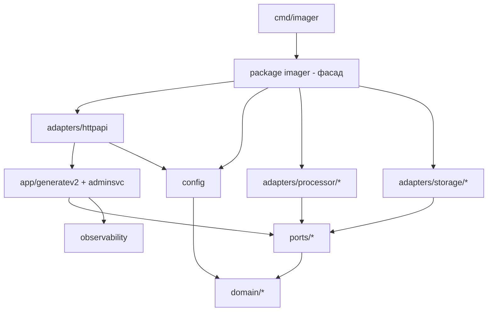

# План: переиспользуемая архитектура проекта imager

## 1. Текущее состояние

- Один Go-модуль: `github.com/pkg-ru/imager` (go 1.25.0), [go.mod](../go.mod)
- [go.work](../go.work) тривиален (`use ./`) — мультимодульности фактически нет
- Вся логика в `internal/` → **недоступна внешним импортёрам** по правилам видимости Go
- Слои чистые (проверено поиском по импортам):

| Слой | Зависимости |
|---|---|
| `internal/domain/*` | только stdlib |
| `internal/application/ports/*` | только domain |
| `internal/observability` | только stdlib |
| `internal/config` | domain + внешний `github.com/pkg-ru/dynamic` |
| `internal/adapters/*` | ports, domain, observability |
| `internal/application/generatev2` | ports, domain, observability + **нарушение**: `adapters/coordination/singleflight` |
| `internal/adapters/httpapi` | всё выше (композиционный корень) |
| `cmd/imager` | httpapi, адаптеры процессоров, observability |

## 2. Рассмотренные варианты

### а) Несколько Go-модулей через go.work (domain / ports / adapters / application)
- ✅ Жёсткие границы, независимое версионирование
- ❌ 4–6 go.mod, каскад `replace` при локальной разработке, отдельные теги для каждого модуля, сложный релизный процесс
- ❌ Избыточно: границы слоёв и так чистые, команда небольшая
- **Вердикт: отклонён** (over-engineering для текущего размера)

### б) Один модуль, перенос `internal/` → корневые публичные пакеты
- ✅ Максимально простая механическая миграция (git mv + rewrite путей)
- ✅ Полностью удовлетворяет требованию «вся логика переиспользуема»
- ❌ Всё становится публичным API — нужен дисциплинированный подход к совместимости
- **Вердикт: взят за основу** (требование пользователя явно требует полной переиспользуемости)

### в) Гибрид: SDK-фасад + сохранение internal
- ✅ Минимальная площадь публичного API
- ❌ Не удовлетворяет требованию «импортировать ВСЮ логику» — внешнее приложение не сможет собрать свой pipeline из адаптеров
- **Вердикт: отклонён как основной**, но фасад добавляется как надстройка над (б)

### Итоговый выбор: **(б) + тонкий публичный фасад**

Один модуль, структура каталогов сохраняется, префикс `internal/` убирается,
сверху добавляется эргономичный фасад для типового сценария использования.

## 3. Целевая структура

```
github.com/pkg-ru/imager
├── imager.go                  # НОВОЕ: фасад package imager (высокоуровневый API)
├── domain/
│   ├── asset/                 # ← internal/domain/asset
│   ├── object/                # ← internal/domain/object
│   ├── policy/                # ← internal/domain/policy
│   ├── processing/            # ← internal/domain/processing
│   └── filemeta/              # ← internal/domain/filemeta
├── ports/
│   ├── storage/               # ← internal/application/ports/storage
│   ├── processor/             # ← internal/application/ports/processor
│   ├── detector/ coordinator/ buffer/ metadata/
├── app/
│   ├── generatev2/            # ← internal/application/generatev2
│   └── adminsvc/              # ← internal/application/adminsvc
├── adapters/
│   ├── httpapi/               # ← internal/adapters/httpapi
│   ├── storage/{fs,s3,sftp,ftp,http,remote}/
│   ├── processor/{libvips,imagemagick,routing,detection,shared}/
│   ├── coordination/singleflight/
│   └── lru/
├── observability/             # ← internal/observability
├── config/                    # ← internal/config
├── cmd/imager/                # остаётся, становится тонкой обёрткой над фасадом
├── docs/                      # обновление
└── go.mod                     # путь модуля — см. риски о /v2
```

Принципы:
- `domain`, `ports`, `observability` не знают ни о ком выше себя
- `config` знает только domain
- `app/*` знает ports + domain (+ coordination после фикса)
- `adapters/*` знают ports + domain; только `httpapi` знает config/app/adapters-фабрики
- Фасад `package imager` (корень) знает всё, но никто не знает фасад



## 4. Пошаговый план миграции

### Шаг 0. Подготовка
- Убедиться, что `go build ./... && go test ./...` зелёные (базовая линия)

### Шаг 1. Исправить нарушение слоёв (до переезда)
- `internal/application/generatev2/service.go` импортирует
  `internal/adapters/coordination/singleflight`. Перенести пакет
  `singleflight` на верхний уровень `coordination/singleflight`
  (он реализует порт `coordinator.Keyed`, это утилита синхронизации, а не адаптер инфраструктуры).
- Обновить импорты в `service.go`, тестах, `httpapi/app.go`.

### Шаг 2. Механический перенос каталогов
Порядок (git mv, сохраняет историю):
```
git mv internal/domain          domain
git mv internal/application/ports        ports
git mv internal/application/generatev2   app/generatev2
git mv internal/application/adminsvc     app/adminsvc
rmdir internal/application
git mv internal/adapters        adapters
git mv internal/observability   observability
git mv internal/config          config
rmdir internal
```

### Шаг 3. Rewrite import-путей
Единая замена во всех `.go` файлах:
```
github.com/pkg-ru/imager/internal/  →  github.com/pkg-ru/imager/
```
(охватывает ~все файлы, включая тесты; проверка: `grep -r "imager/internal/" .` — 0 результатов)

Затем: `go mod tidy && go build ./... && go vet ./... && go test ./...`

### Шаг 4. Публичный фасад `package imager` (корень)
Файл `imager.go` + `options.go`. Эргономичный API для внешнего приложения:

```go
package imager

// Собрать полный HTTP-сервер из YAML-конфига (обёртка над текущим main).
func NewServer(ctx context.Context, cfgDir string) (*Server, error)

// Программная сборка pipeline без YAML — для встраивания.
type Options struct {
    Sources    ports_storage.SourceStore   // или фабрика из конфига
    Results    ports_storage.ResultStore
    Processor  ports_processor.Processor
    Policy     *policy.Policy
    Presets    *asset.PresetSet
    Logger     observability.Logger
    Metrics    observability.Metrics
    // ...
}
func New(ctx context.Context, opts Options) (*App, error) // обёртка httpapi.Build

// Переиспользование по частям (внешнее приложение собирает своё):
// - domain/asset.Parse* — парсинг/канонизация asset URL
// - adapters/processor/libvips.NewProcessor(...) — движок обработки
// - adapters/storage/s3.NewSourceStore(...) — хранилища
// - app/generatev2.NewService(deps) — use case напрямую
```

Также вынести из `cmd/imager` переиспользуемое:
- `pixel_embed.go` (генератор пикселей) → `adapters/httpapi/pixel_embed.go`
  или отдельный `adapters/pixel`; в `cmd/imager` оставить только вызов.
- `buildProcessor`, `slogLevel` → в фасад (`imager/processor.go`).

### Шаг 5. Тонкий cmd/imager
`main.go` сокращается до: чтение env → `imager.NewServer(...)` → обработка сигналов/shutdown (или это тоже уходит в фасад как `Server.Run(ctx)`).

### Шаг 6. Документация (docs/)
- Новый `docs/REUSE.md`: как импортировать библиотеку, примеры (полный сервер, встраивание, использование отдельных компонентов), требования сборки (тег `libvips`, cgo/govips)
- Обновить `docs/INSTALLATION.md`, `docs/API.md`, `docs/CONFIGURATION.md` — новые пути пакетов
- README: секция «Использование как библиотеки»

### Шаг 7. CI/Docker
- Dockerfile: пути сборки не меняются (модуль один), проверить `go.work` (можно удалить или оставить `use .`)
- CI: добавить шаг проверки отсутствия `internal/` ссылок и обратной совместимости (`go build` примера внешнего потребителя, например `example/library-client/main.go`)

## 5. Риски и меры

| Риск | Описание | Мера |
|---|---|---|
| **Мажорная версия модуля** | Если уже тегировались v0/v1 — ломающее изменение путей требует суффикса `/v2` (правила Go semver). Если тегов нет — можно тегнуть v1.0.0 сразу после миграции | Проверить `git tag`; при наличии тегов → `module github.com/pkg-ru/imager/v2` + все импорты |
| **Циклические зависимости** | После открытия пакетов легко создать цикл (напр. фасад ↔ httpapi) | Правило: фасад никем не импортируется; CI-проверка `go list -deps` направленности графа |
| **Нарушение слоёв «по привычке»** | Публичность снимает защиту компилятора от импорта domain → adapters | Code review + опционально depguard/linter в CI |
| **Стабильность публичного API** | Все экспортированные идентификаторы становятся контрактом | Перед тегом v1 ревизия экспортируемых имён; semver-дисциплина далее |
| **replace/go.work у потребителей** | Локальная разработка внешнего приложения против ещё не опубликованной версии | До публикации: `replace github.com/pkg-ru/imager => ../imager` в go.mod потребителя; go.work в самом репо не мешает |
| **cgo/govips** | Внешние потребители должны собирать с `-tags libvips` и иметь libvips в системе | Задокументировать в REUSE.md; imagemagick-фолбэк работает без тега |
| **Build tags / platform-файлы** | fs/quota_windows.go, secure_open_* и т.п. — переезд не влияет, но тесты на CI должны гоняться на всех ОС | Сохранить матрицу CI |
| **Встроенные ресурсы** | `cmd/imager/pixels/*.apng` и др. — embed-пути относительны каталогу пакета | При переносе pixel_embed.go перенести и каталог pixels/ |

## 6. Критерии готовности

1. `grep -r "imager/internal/" --include="*.go" .` → пусто
2. Внешний пример `example/library-client` (отдельный модуль с `replace`) собирается и использует: парсинг asset URL, libvips-процессор, S3-хранилище, generatev2-сервис
3. `go test ./...` зелёный
4. `cmd/imager` — ≤ 50 строк, вся логика в библиотечных пакетах
5. docs/REUSE.md описывает все три сценария reuse
